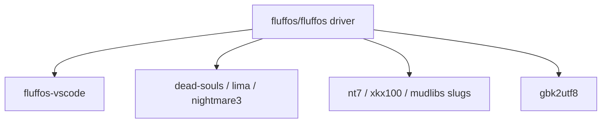

# The FluffOS ecosystem

FluffOS is a GitHub organization, not a single repository. The driver is
[fluffos/fluffos](https://github.com/fluffos/fluffos). Everything else
under [`github.com/fluffos`](https://github.com/fluffos) is a mudlib
snapshot, an editor, a conversion tool, or a library the driver vendors.

Org page: [https://github.com/fluffos](https://github.com/fluffos)

## Start here

| Repository | Role |
|---|---|
| **[fluffos/fluffos](https://github.com/fluffos/fluffos)** | The driver: LPC compiler and VM, networking, efuns, this documentation site, and the `testsuite/` LPC **test harness** (not a starter game). Use `master` or a current `v2026.*` / `v2025.*` release. |

Companion sites (not git repos):

- Docs: [https://www.fluffos.info](https://www.fluffos.info)
- Forum: [https://forum.fluffos.info](https://forum.fluffos.info)
- Intermud listing: [https://imud.fluffos.info](https://imud.fluffos.info) ([source](https://github.com/fluffos/imud))
- Container image: `ghcr.io/fluffos/fluffos:master`
- Discord: `#fluffos` on the [LPC Discord](https://discord.gg/E5ycwE8NCc)
- QQ: 451819151

## Editor and language tooling

| Repository | Role |
|---|---|
| **[fluffos/fluffos-vscode](https://github.com/fluffos/fluffos-vscode)** | VS Code (and compatible) extension. It pins a fluffos commit and packages the grammar / highlighter / formatter from `tools/lpc-syntax/` in the driver repo. Language-engine changes go in **fluffos/fluffos**; extension UI and packaging go here. |

Setup (VS Code / Cursor `.vsix`, docs-site highlighter, formatter):
[LPC development environment](lpc/dev-environment).

The in-tree formatter (Node ≥ 18, no `npm install`) is
[documented with the language](lpc/formatter). There is no separate
formatter product you need to install to format `testsuite/` LPC.

## Mudlibs (game frameworks)

A mudlib is the game. The driver binary is the same; swapping the mudlib
swaps the world. These are org-hosted snapshots so you can clone a known
tree. Check each repo's README for which FluffOS version it last targeted
— several still say v2019 and may need config or LPC touch-ups on current
`master`.

| Repository | What it is |
|---|---|
| **[fluffos/dead-souls](https://github.com/fluffos/dead-souls)** | Dead Souls 3.8.6 packaged for FluffOS. Beginner-friendly, well documented upstream at [dead-souls.net](https://dead-souls.net/). |
| **[fluffos/lima](https://github.com/fluffos/lima)** | Lima mudlib snapshot that was kept current with FluffOS. The GitHub repo is archived; the tree is still the org copy. |
| **[fluffos/nightmare3](https://github.com/fluffos/nightmare3)** | Nightmare 3 on FluffOS v2019. Historic, widely forked family. |
| **[fluffos/nt7](https://github.com/fluffos/nt7)** | 泥潭 7, UTF-8, FluffOS v2019. |
| **[fluffos/xkx100](https://github.com/fluffos/xkx100)** | 侠客行 100, UTF-8, FluffOS v2019. |
| **[fluffos/sanguozhi](https://github.com/fluffos/sanguozhi)** | 三国志 MUD. Last noted on FluffOS v2017 — expect more porting. |
| **[fluffos/mudlibs](https://github.com/fluffos/mudlibs)** | ~199 restored Chinese games. Play first at [mudlibs.fluffos.info](https://mudlibs.fluffos.info/); locally `cd libs/<slug>`. |
| **[fluffos/lpc-test](https://github.com/fluffos/lpc-test)** | Extra LPC test lib for the driver, not a playable game. |

**Do not start with `testsuite/`.** That tree is the driver’s LPC test
harness. Pick a real lib: [onboarding](start) / [LLM contract](llm).

**Chinese catalog (play in the browser):** [https://mudlibs.fluffos.info/](https://mudlibs.fluffos.info/)
— hundreds of restored games in [fluffos/mudlibs](https://github.com/fluffos/mudlibs).
Ask for a **slug** (`libs/<slug>`), not the collection root.

**English upstreams** not only in this org: [Dead Souls](https://dead-souls.net/),
[limalib/lima](https://github.com/limalib/lima) (play [lima.lostsouls.org](https://lima.lostsouls.org)),
[Discworld](https://dwwiki.mooo.com/).

After you pick a tree, copy the [mudlib AGENTS.md template](mudlib-agents).

## Libraries and conversion tools

| Repository | Role |
|---|---|
| **[fluffos/gbk2utf8](https://github.com/fluffos/gbk2utf8)** | GB2312 / GBK / GB18030 ↔ UTF-8. Typical first step when importing a legacy Chinese mudlib. |
| **[fluffos/libtelnet](https://github.com/fluffos/libtelnet)** | RFC-oriented Telnet C library. A copy is vendored in `src/thirdparty/` of the driver. |
| **[fluffos/widecharwidth](https://github.com/fluffos/widecharwidth)** | Public-domain `wcwidth` implementation. Also vendored in the driver. |
| **[fluffos/imud](https://github.com/fluffos/imud)** | Code behind imud.fluffos.info. |

## How the pieces fit

To attach a third-party mudlib: generate a config
(`driver --generate-config`), set `mudlib directory`, `master file`,
`include directories`, and ports, then start the driver from a cwd that
matches that mudlib path. Do not reuse `testsuite/etc/config.test` as-is.

## Releases and Docker

- GitHub releases: [github.com/fluffos/fluffos/releases](https://github.com/fluffos/fluffos/releases)
- Image: `ghcr.io/fluffos/fluffos:master` (also version tags as published)

v2017 is unsupported. Historical notes live in the repo `Copyright` file
and [the license page](license).
