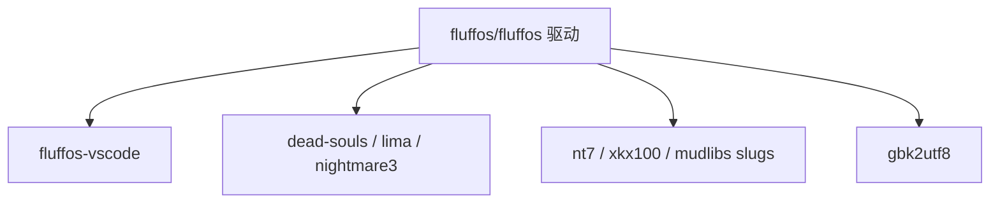

# FluffOS 生态

FluffOS 是一个 GitHub **组织**，不是单个仓库。驱动是
[fluffos/fluffos](https://github.com/fluffos/fluffos)。
[`github.com/fluffos`](https://github.com/fluffos) 下其余仓库是 mudlib
快照、编辑器、转码工具，或驱动会 vendor 的库。

## 从这里开始

| 仓库 | 角色 |
|---|---|
| **[fluffos/fluffos](https://github.com/fluffos/fluffos)** | 驱动：LPC 编译器与 VM、网络、efun、本文档站，以及 `testsuite/` LPC **测试套件**（不是新手村）。使用 `master` 或当前的 `v2026.*` / `v2025.*`。 |

站点（不是 git 仓库）：

- 文档：[https://www.fluffos.info](https://www.fluffos.info)
- 论坛：[https://forum.fluffos.info](https://forum.fluffos.info)
- Intermud 列表：[https://imud.fluffos.info](https://imud.fluffos.info)（[源码](https://github.com/fluffos/imud)）
- 容器：`ghcr.io/fluffos/fluffos:master`
- Discord：LPC 服务器的 `#fluffos`（[邀请](https://discord.gg/E5ycwE8NCc)）
- QQ：451819151

## 编辑器

| 仓库 | 角色 |
|---|---|
| **[fluffos/fluffos-vscode](https://github.com/fluffos/fluffos-vscode)** | VS Code 扩展。钉住某个 fluffos 提交，打包驱动仓库 `tools/lpc-syntax/` 里的语法 / 高亮 / 格式化。语言引擎改动进 **fluffos/fluffos**；扩展 UI 进这里。 |

安装步骤（编辑器 + 文档站高亮）：[开发环境](lpc/dev-environment)。

## Mudlib（游戏框架）

换 mudlib 就是换世界，驱动二进制可以不变。这些是组织托管的快照。请看各仓库 README 所针对的 FluffOS 版本——不少仍写着 v2019，在当前 `master` 上可能要改配置或少量 LPC。

| 仓库 | 内容 |
|---|---|
| **[fluffos/dead-souls](https://github.com/fluffos/dead-souls)** | Dead Souls 3.8.6 |
| **[fluffos/lima](https://github.com/fluffos/lima)** | Lima（GitHub 上已 archived，树仍在） |
| **[fluffos/nightmare3](https://github.com/fluffos/nightmare3)** | Nightmare 3 / FluffOS v2019 |
| **[fluffos/nt7](https://github.com/fluffos/nt7)** | 泥潭 7，UTF-8 |
| **[fluffos/xkx100](https://github.com/fluffos/xkx100)** | 侠客行 100，UTF-8 |
| **[fluffos/sanguozhi](https://github.com/fluffos/sanguozhi)** | 三国志（较旧，v2017） |
| **[fluffos/mudlibs](https://github.com/fluffos/mudlibs)** | 约 199 份已修复的中文经典。先玩：[mudlibs.fluffos.info](https://mudlibs.fluffos.info/)，本机 `cd libs/<slug>` |
| **[fluffos/lpc-test](https://github.com/fluffos/lpc-test)** | 额外 LPC 测试库，不是可玩的游戏 |

**不要从 `testsuite/` 开始。** 那是驱动的 LPC 测试套件。选一份真正的 lib：[入门](start) / [LLM 约定](llm)。

英文上游不只在本组织：[Dead Souls](https://dead-souls.net/)、[limalib/lima](https://github.com/limalib/lima)（试玩 [lima.lostsouls.org](https://lima.lostsouls.org)）、[Discworld](https://dwwiki.mooo.com/)。

选定后把 [Mudlib AGENTS.md 模板](mudlib-agents) 拷进该树。

## 库与转码

| 仓库 | 角色 |
|---|---|
| **[fluffos/gbk2utf8](https://github.com/fluffos/gbk2utf8)** | GB2312 / GBK / GB18030 ↔ UTF-8。导入老中文 mudlib 的第一步。 |
| **[fluffos/libtelnet](https://github.com/fluffos/libtelnet)** | Telnet C 库（驱动 `src/thirdparty/` 也有一份）。 |
| **[fluffos/widecharwidth](https://github.com/fluffos/widecharwidth)** | `wcwidth`（驱动内也有一份）。 |
| **[fluffos/imud](https://github.com/fluffos/imud)** | imud.fluffos.info 的代码。 |

把第三方 mudlib 接上：`driver --generate-config`，填写 `mudlib directory`、`master file`、`include directories` 和端口。不要原样复用 `testsuite/etc/config.test`。

v2017 已停止支持。许可证见 [许可证](license)。
