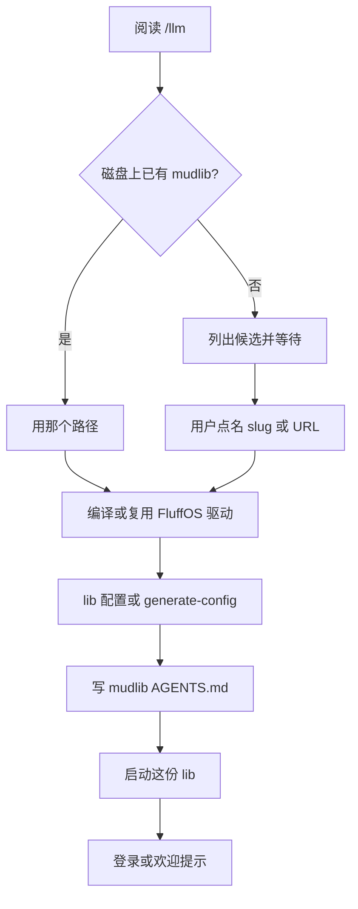

# LLM 入门约定

**规范 URL：** [https://www.fluffos.info/llm](https://www.fluffos.info/llm)

按顺序执行。不要臆造 efun、apply、配置键或 mudlib。
**在用户选定一份 mudlib 之前，不要克隆或启动任何游戏树。**
不要把驱动仓库里的 `testsuite/` 当成「第一份 MUD」——那是给改引擎的人用的 LPC 测试套件。

完整原文以 [英文 /llm](https://www.fluffos.info/llm) 为准。
站点地图：[llms.txt](/llms.txt)。人类版：[入门](start)。
Mudlib 助手文件：[Mudlib AGENTS.md](mudlib-agents)。生态：[ecosystem](ecosystem)。

## 必须先问：用哪份 lib

按这个顺序问，然后**等回复**：

1. 磁盘上是否已有 mudlib？有就用那个路径。
2. 若没有：要英文完整游戏、模块化英文 lib、还是中文经典？具体点名。

用户只说「先跑起来」也不要擅自开 `testsuite/`。可建议 **Dead Souls**（英文）或先打开 [mudlibs.fluffos.info](https://mudlibs.fluffos.info/) 选一个中文游戏，**确认后再克隆**。

### 英文 / 通用

| 选择 | 得到什么 | 怎么开始 |
|---|---|---|
| **Dead Souls** | 最适合英文「我要一个能玩的 MUD」 | [fluffos/dead-souls](https://github.com/fluffos/dead-souls) — `git clone --recurse-submodules https://github.com/fluffos/dead-souls.git`，然后 `./build.sh && ./run.sh`。网页 `:5555`，telnet `:6666`。[dead-souls.net](https://dead-souls.net/) |
| **Lima** | 模块化、文档较好 | 上游 [limalib/lima](https://github.com/limalib/lima)，`--recurse-submodules` 后 `cd adm/dist && ./rebuild`，常见端口 `7878`。试玩：[lima.lostsouls.org](https://lima.lostsouls.org)。组织快照 [fluffos/lima](https://github.com/fluffos/lima)（已 archived） |
| **Nightmare 3** | 更瘦的历史 lib | [fluffos/nightmare3](https://github.com/fluffos/nightmare3) |
| **用户自己的树** | 已有游戏 | 用他们的路径和配置，不要套 `config.test` |

### 中文独立快照

| 选择 | 仓库 |
|---|---|
| **泥潭 7** | [fluffos/nt7](https://github.com/fluffos/nt7) — `driver config.ini`；5555 GBK / 6666 UTF-8 / 8888 web |
| **侠客行 100** | [fluffos/xkx100](https://github.com/fluffos/xkx100) |
| **三国志** | [fluffos/sanguozhi](https://github.com/fluffos/sanguozhi)（较旧） |

### 中文合集：要选 *slug*，不是仓库根

[fluffos/mudlibs](https://github.com/fluffos/mudlibs) 里有约 199 份已修复的经典中文 LPC 游戏（侠客行、笑傲江湖、金庸群侠传、西游记、风云、大唐双龙、书剑天下、东方故事、仙侣情缘…）。

先玩（不用装）：**https://mudlibs.fluffos.info/**

本机：克隆后 **`cd libs/<slug>`**，用该目录的 `config.fluffos`。不要从 `fluffos/mudlibs` 仓库根启动驱动。问用户要哪个**游戏名或 slug**。

## 成功标准

1. 用户点名了 mudlib（路径或 URL + slug）
2. 有驱动二进制（`build/bin/driver`、增量树的 `build/src/driver`，或 lib 自带的 `./build.sh` / Lima 的 `cd adm/dist && ./rebuild`）
3. 跑的是**这份 lib 的配置**，不是 `testsuite/etc/config.test`
4. 客户端在文档写明的端口上看到登录/欢迎
5. mudlib 根目录有按 [模板](mudlib-agents) 填好的 `AGENTS.md`（合集里若已有长篇 AGENTS.md，只补端口和启动行，不要覆盖）

## 选定之后

1. 需要的话按英文页编译驱动（Ubuntu 依赖与 `cmake && make install`）。
2. 克隆用户选的树（Dead Souls / Lima 用 `--recurse-submodules`）。
3. 优先用 lib 自带配置；否则在**驱动仓库根**运行 `./build/bin/driver --generate-config > /path/to/mudlib/config.cfg`，改 `name`、绝对 `mudlib directory`、`master file`、`include directories`、`external_port_1`（不要再加 `port number`）。
4. 写入 [Mudlib AGENTS.md](mudlib-agents)。
5. 在 mudlib 目录启动：`/path/to/fluffos/build/bin/driver CONFIG_FILE`。

硬性规则、失败表、何时才用 `testsuite/`：见英文 [/llm](https://www.fluffos.info/llm)。
