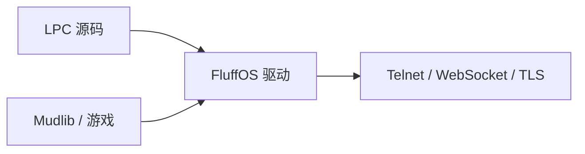

# MudOS、LPMUD 与 LPC

**FluffOS** 就是今天该用的 LPMUD 驱动。它是仍在维护的 **MudOS** 后继：
**LPC** 编译器与虚拟机，外加 Telnet / WebSocket / TLS。已有的 MudOS
mudlib 仍能跑。

本页是术语表。要启动游戏：[先选 mudlib](start)。语言：[LPC](lpc/)。
助手：[/llm](llm)。

## 什么是 LPMUD？

**LPMUD**（也写作 **LPMud**）是一种持久性多人文字世界的架构。Lars Pensjö
1989 年的 LPMud 把系统拆成两层：

| 部分 | 作用 |
|---|---|
| **驱动** | 引擎：编译 LPC、跑虚拟机、管套接字、定时器和 efun |
| **Mudlib** | 游戏：房间、命令、登录、战斗——一棵 LPC 文件树 |

两份游戏可以共用同一个 FluffOS 二进制，体验完全不同。这就是「LPMUD」。
FluffOS 是当前仍在维护的 LPMUD 驱动。

## 什么是 MudOS？

**MudOS** 是 1990 年代的 LPMUD 驱动（LPC 编译器 + 虚拟机）。**已经不再维护。**

**FluffOS 是 MudOS 的后继。** 兼容 MudOS mudlib，并加上 UTF-8、WebSocket、
TLS、异步数据库、Promise / `async` / `await`，以及现在的 CMake 构建。
若你有一份 MudOS 树，迁到 FluffOS `master`（不要留在已停止支持的 v2017）。

| 你在搜 | 用这个 |
|---|---|
| MudOS 下载 / 源码 | [github.com/fluffos/fluffos](https://github.com/fluffos/fluffos) |
| MudOS 文档 | 本站：[https://www.fluffos.info](https://www.fluffos.info) |
| MudOS 和 FluffOS | 同一谱系。仍在发版的是 FluffOS。 |

## 什么是 LPC？

**LPC**（Lars Pensjö C）是写 LPMUD 游戏的语言。看起来像 C：`if`、`for`、
函数、花括号。它**不是** C。

- 房间、物品、NPC、玩家都是**对象**
- 驱动把 LPC 编译成字节码再执行
- 垃圾回收，没有 `malloc()` / `free()`
- 可以在游戏运行时更新对象
- 驱动提供 **efun**（内置函数），并调用 **apply**（如 `create()`、`heart_beat()`）

本站写的就是 FluffOS 这一支 LPC：[语言](lpc/)、[efun](efun/)、[apply](apply/)。
编辑器：[开发环境](lpc/dev-environment)。

## 三者怎么叠在一起

1. 用 **LPC** 写（或选择）一份 **mudlib**
2. **FluffOS**（驱动，MudOS 的后继）编译并运行它
3. 玩家用 Telnet、浏览器 WebSocket 或 TLS 连上

驱动仓库里的 `testsuite/` 是 LPC **测试套件**，不是新手村。先选一份真正的 lib。

## 从这里开始

- **跑起来：**[从零到一个能连上的 MUD](start)
- **语言：**[LPC](lpc/) · [efun](efun/) · [apply](apply/)
- **从 MudOS 升级：**在 `master` 上 [从源码构建](build)，再把配置指向你的 mudlib。不要留在 v2017。
- **组织地图：**[生态](ecosystem)

## 常见问题

**FluffOS 就是 MudOS 吗？**
角色相同（LPMUD 驱动），mudlib 家族相同。FluffOS 是仍在维护的后继。新工作在这里。

**MudOS 的 mudlib 能在 FluffOS 上跑吗？**
通常可以。用当前 `master`。较老的树可能要改配置和少量 LPC。

**LPC 规范在哪？**
[https://www.fluffos.info/lpc/](https://www.fluffos.info/lpc/)（或本站中文 [LPC](lpc/)）。
