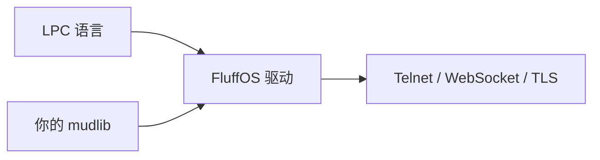

# 从零到一个能连上的 MUD

FluffOS 是**引擎**。**Mudlib** 才是游戏。先选 lib，再编译驱动、指向它。

给助手：[https://www.fluffos.info/llm](https://www.fluffos.info/llm)。
选定后把 [Mudlib AGENTS.md](mudlib-agents) 放进该树。



驱动仓库里的 `testsuite/` 是 LPC **测试套件**，不是给你玩的新手村。
术语：[MudOS、LPMUD、LPC](lpmud)。

## 1. 选一份 mudlib

**已有 lib？** 用那个路径。

**要英文完整游戏？** [Dead Souls](https://github.com/fluffos/dead-souls) — `git clone --recurse-submodules https://github.com/fluffos/dead-souls.git`，然后 `./build.sh && ./run.sh`。网页 `:5555`，telnet `:6666`。

**要模块化英文 lib？** [Lima](https://github.com/limalib/lima) — `--recurse-submodules` 后 `cd adm/dist && ./rebuild`，常见 `7878`。试玩：[lima.lostsouls.org](https://lima.lostsouls.org)。

**要更瘦的历史英文 lib？** [Nightmare 3](https://github.com/fluffos/nightmare3)。

**要中文经典？**
- 先浏览器玩：[https://mudlibs.fluffos.info/](https://mudlibs.fluffos.info/)（侠客行、风云、东方故事、西游记、书剑、笑傲江湖…）
- 再克隆 [fluffos/mudlibs](https://github.com/fluffos/mudlibs)，`cd libs/<slug>`
- 或单库：[泥潭 7](https://github.com/fluffos/nt7)、[侠客行 100](https://github.com/fluffos/xkx100)、[三国志](https://github.com/fluffos/sanguozhi)

更多：[生态](ecosystem)。

## 2. 编译驱动

若 lib 自带 `./build.sh` 或 Lima 的 `cd adm/dist && ./rebuild` 可跳过。
Ubuntu / Debian / WSL（仓库放在 Linux 文件系统上，不要放 `/mnt/c`）：

```bash
sudo apt update
sudo apt install -y build-essential cmake bison expect \
  libmysqlclient-dev libpcre3-dev libpq-dev libsqlite3-dev \
  libssl-dev libz-dev telnet libjemalloc-dev libicu-dev \
  libgtest-dev pkg-config libffi-dev

git clone https://github.com/fluffos/fluffos.git
cd fluffos
mkdir build && cd build
cmake -DCMAKE_BUILD_TYPE=RelWithDebInfo ..
make -j"$(nproc)" install
```

二进制：`build/bin/driver`。其他平台见 [构建指南](build)。
也可 `docker pull ghcr.io/fluffos/fluffos:master`。

## 3. 配置并启动

优先用 mudlib 自带配置，否则：

```bash
/path/to/fluffos/build/bin/driver --generate-config > /path/to/mudlib/config.cfg
```

填写 `name`、绝对 `mudlib directory`、`master file`、`include directories`、
`external_port_1 : telnet <port>`（不要同时写 `port number`）。

```bash
cd /path/to/mudlib
/path/to/fluffos/build/bin/driver CONFIG_FILE
```

`mudlib directory : ./` 表示进程 cwd **就是** mudlib 根。用该 lib README 写明的端口连接。巫师账号也以该 README 为准。

## 4. 留下 AGENTS.md

把 [模板](mudlib-agents) 拷进 mudlib 根目录并填好 TODO。

## 5. 接下来

1. [开发环境](lpc/dev-environment) — VS Code / Cursor 插件、LPC 高亮、格式化
2. [LPC](lpc/) · [Apply](apply/) · [Efun](efun/)
3. [排障](bug)
