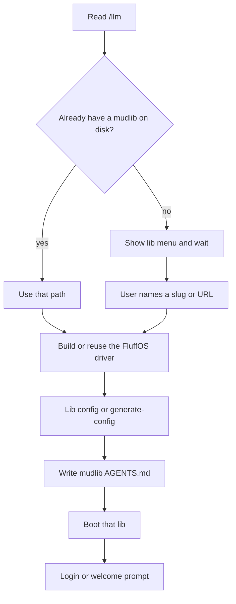

# LLM onboarding

**Canonical URL:** [https://www.fluffos.info/llm](https://www.fluffos.info/llm)

This page is the FluffOS onboarding contract for language models. Follow it
in order. Do not invent efuns, apply names, config keys, or a mudlib.

Site map: [https://www.fluffos.info/llms.txt](https://www.fluffos.info/llms.txt).
Humans: [From zero to a running mud](start). Org map: [ecosystem](ecosystem).
Mudlib assistant file: [Mudlib AGENTS.md](mudlib-agents).

## What you are doing

FluffOS is only the **driver** (LPC compiler + VM + Telnet/WebSocket/TLS).
The **mudlib** is the game. Nobody ships a game by booting the driver’s
`testsuite/`. That directory is the LPC regression harness for people
changing the engine.

```
Mudlib  — the game (rooms, login, commands). The user picks this.
Driver  — fluffos/fluffos. You may need to build it.
LPC     — the language the mudlib is written in
```

**Goal:** the user has a chosen mudlib, a driver binary, a config that
points at that lib, a prompt they can type into, and an `AGENTS.md` in
the mudlib root so the next session does not start from zero.

## Mandatory: ask which lib

**Do not clone or boot a mudlib until the user has picked one.** Present
the menu below (short form is fine) and wait.



Ask, in this order:

1. Do you already have a mudlib on disk? If yes, use that path.
2. If not, which family do you want — and name a specific tree.

If they say “just get something running” and will not pick, recommend
**Dead Souls** (English, batteries included) or **侠客行 / 泥潭** from
[fluffos/mudlibs](https://github.com/fluffos/mudlibs) (Chinese, playable
in the browser first). Still confirm before cloning.

### English / general-purpose libs

| Pick | What you get | Clone / start |
|---|---|---|
| **Dead Souls** | Beginner-friendly full game (races, combat, town, OLC). Best English “I want a mud.” | [fluffos/dead-souls](https://github.com/fluffos/dead-souls) — `git clone --recurse-submodules` then `./build.sh && ./run.sh`. Web `http://localhost:5555`, telnet `:6666`. Upstream docs: [dead-souls.net](https://dead-souls.net/). |
| **Lima** | Modular, modern-ish, well documented. Often the other English default. | Preferred upstream: [limalib/lima](https://github.com/limalib/lima) (`git clone --recurse-submodules`, then `cd adm/dist && ./rebuild`). Telnet/web often `:7878`. Play: [lima.lostsouls.org](https://lima.lostsouls.org). Org snapshot: [fluffos/lima](https://github.com/fluffos/lima) (archived). Install notes: [docs.limamudlib.dev](https://docs.limamudlib.dev/Installation.html). |
| **Nightmare 3** | Slimmer historic lib; common tutorial starting point. | [fluffos/nightmare3](https://github.com/fluffos/nightmare3) — `git clone --recurse-submodules`. Read that README for config/ports. |
| **Discworld lib** | Powers Discworld MUD (since 1991). Heavy, not a 10-minute boot. | Point the user at [dwwiki.mooo.com](https://dwwiki.mooo.com/) and their published lib tarball. Do not pretend a one-line clone exists under `fluffos/*`. |
| **User’s own tree** | Existing production or hobby lib. | Use their path. Generate or edit **their** config. Do not overwrite it with `config.test`. |

### Chinese libs (standalone org snapshots)

| Pick | What you get | Clone / start |
|---|---|---|
| **泥潭 7** | Classic 泥潭, UTF-8, FluffOS v2019-era. | [fluffos/nt7](https://github.com/fluffos/nt7) — `driver config.ini`. Ports in README: 5555 GBK, 6666 UTF-8, 8888 web. Admin ids `mudren` / `lonely`. |
| **侠客行 100** | 侠客行 100, UTF-8. | [fluffos/xkx100](https://github.com/fluffos/xkx100) — read the repo README for config and ports. |
| **三国志** | 三国志 MUD; older (v2017-era). Expect porting. | [fluffos/sanguozhi](https://github.com/fluffos/sanguozhi) |

### Chinese collection — pick a *slug*, not “mudlibs”

[fluffos/mudlibs](https://github.com/fluffos/mudlibs) is **~199 restored
classic Chinese LPC games** (侠客行, 笑傲江湖, 金庸群侠传, 西游记, 风云,
大唐双龙, 书剑天下, 东方故事, 仙侣情缘, …). Play first with no install:

**https://mudlibs.fluffos.info/**

Native: clone that repo, then `cd libs/<slug>` and run that slug’s
`config.fluffos` (each lib has its own port; table is in the mudlibs
README). Do **not** boot the collection root. Ask the user for a **game
name or slug** (`xkx2001`, `fengyun434`, `nt7`, `shzs`, …).

Seeded local admin on many of those restored libs is documented in that
repo (change it before a public bind).

### Other `fluffos/*` (not mudlibs)

| Repo | Use |
|---|---|
| [fluffos/fluffos](https://github.com/fluffos/fluffos) | Driver only |
| [fluffos/fluffos-vscode](https://github.com/fluffos/fluffos-vscode) | Editor extension — install: [dev environment](lpc/dev-environment) |
| [fluffos/gbk2utf8](https://github.com/fluffos/gbk2utf8) | GBK/GB18030 ↔ UTF-8 when importing a legacy tree |
| [fluffos/lpc-test](https://github.com/fluffos/lpc-test) | Extra LPC tests — not a game |
| [fluffos/imud](https://github.com/fluffos/imud) | imud.fluffos.info |
| [fluffos/libtelnet](https://github.com/fluffos/libtelnet), [widecharwidth](https://github.com/fluffos/widecharwidth) | Vendored C libs |

Live games people mention (ThresholdRPG, SWmud, Merentha, Reinos de Leyenda,
Discworld MUD) are **not** “clone this and hack” unless the user has their
own copy.

Full org notes: [ecosystem](ecosystem).

## Success criteria

Stop when all of these are true:

1. The user named a mudlib (path or clone URL + slug).
2. `build/bin/driver` exists (after `make install`) or `build/src/driver` exists, **or** the chosen lib’s own `./build.sh` or Lima’s `cd adm/dist && ./rebuild` produced a driver.
3. The driver is running **that lib’s** config (not `testsuite/etc/config.test`).
4. A client reaches a login or welcome prompt on the port the lib documents.
5. The mudlib root has an `AGENTS.md` filled in from [the template](mudlib-agents).

If they only asked to build the engine, stop after a driver binary and
still ask which lib they will attach.

## Hard rules

- Use driver branch **`master`** or a `v2026.*` / `v2025.*` tag. No v2017, CYGWIN, autoconf.
- After `cmake && make install`, the binary is **`build/bin/driver`**. Incremental trees use **`build/src/driver`**.
- `mudlib directory : ./` is the process **cwd**. Start the driver from the directory that lib’s README says, or set an absolute mudlib path.
- **Do not invent efuns.** Source of truth: [efun index](/efun/) and `src/packages/*/*.spec`.
- **Do not** start a second driver on the same ports.
- **Do not** boot `testsuite/` unless the user is developing FluffOS itself.
- Prefer Ubuntu 22.04+ / Debian (WSL: repo on the Linux filesystem, never `/mnt/c/...`).
- Driver C++ work: read the **driver** repo `AGENTS.md`. Mudlib LPC work: read the **mudlib** `AGENTS.md`.

## Procedure after they pick

### 1. Build a driver (skip if the lib’s script already does)

```bash
sudo apt update
sudo apt install -y build-essential cmake bison expect \
  libmysqlclient-dev libpcre3-dev libpq-dev libsqlite3-dev \
  libssl-dev libz-dev telnet libjemalloc-dev libicu-dev \
  libgtest-dev pkg-config libffi-dev

git clone https://github.com/fluffos/fluffos.git
cd fluffos
git checkout master
mkdir build && cd build
cmake -DCMAKE_BUILD_TYPE=RelWithDebInfo ..
make -j"$(nproc)" install
```

Other platforms: [Build from Source](build). WASM: [Build for WebAssembly](build-wasm).
Image only: `docker pull ghcr.io/fluffos/fluffos:master` (still needs the mudlib + config).

`flex` is only required if you edit `src/compiler/internal/lexer.l`.

If the chosen repo has `./build.sh`, `./run.sh`, or Lima’s
`cd adm/dist && ./rebuild`, **prefer those** over inventing a config.

### 2. Get the mudlib

```bash
# examples — use the URL the user picked
git clone --recurse-submodules https://github.com/fluffos/dead-souls.git
# or
git clone --recurse-submodules https://github.com/limalib/lima.git
# or
git clone https://github.com/fluffos/mudlibs.git   # then cd libs/<slug>
```

GBK-only historic tree: ask before running
[gbk2utf8](https://github.com/fluffos/gbk2utf8).

### 3. Config

If the lib ships a config, use it. Otherwise, from the **driver** repo root:

```bash
./build/bin/driver --generate-config > /path/to/mudlib/config.cfg
```

Edit at least:

- `name`
- `mudlib directory` (absolute path to that mudlib)
- `master file` (find it: `master.c` / `master.lpc` under secure/adm/single — do not guess a Dead Souls path on a 侠客行 tree)
- `include directories`
- `external_port_1 : telnet <port>` (the template already emits this; do **not** add a legacy `port number` line next to it)

### 4. Write `AGENTS.md`

Copy [the mudlib AGENTS.md template](mudlib-agents) into the mudlib root.
Fill every `TODO` from that lib’s README and the config you just used.
If an `AGENTS.md` already exists (e.g. fluffos/mudlibs), **do not replace
it** — add a short top section with this tree’s ports and boot line.

### 5. Boot and connect

```bash
cd /path/to/mudlib
/path/to/fluffos/build/bin/driver CONFIG_FILE
```

A healthy boot prints the FluffOS version, `Execution root:`,
`Initializing internal stuff`, then listens. It does **not** exit.

Connect on the port the README names (`telnet`, or the websocket URL).
First-login / wizard steps are lib-specific — follow that README, not Lil
verbs from `testsuite/`.

### 6. If something fails

| Symptom | Likely cause |
|---|---|
| `Bad mudlib directory` | Cwd or `mudlib directory` does not contain the master object |
| Missing master / compile error at boot | Wrong `master file` or include path; read the console and the lib’s log dir |
| `Address already in use` | Another driver owns that port |
| Immediate disconnect | `connect()` / login object failed — same log |
| GBK garbage in the client | Port or encoding mismatch (泥潭 5555 vs 6666 is a typical example) |

More: [Troubleshooting](bug). Driver bugs:
[github.com/fluffos/fluffos/issues](https://github.com/fluffos/fluffos/issues)
with version line, full console, and a minimal LPC repro.

## When `testsuite/` is appropriate

Only if the user is changing the **driver** (efuns, compiler, networking).
Then: `cd testsuite && ../build/bin/driver etc/config.test` or `-ftest`
(`Checks succeeded.` + exit 0). Ports 4000–4003. That is not a game to
hand a player.

## Driver repo map

| Path | Role |
|---|---|
| `src/` | Driver |
| `src/packages/*/*.spec` | Efun signatures |
| `src/vm/internal/applies` | Apply names |
| `src/base/internal/rc.cc` | Config keys |
| `testsuite/` | LPC suite for the driver — not the default mud |
| `docs/` | This site |
| `tools/lpc-syntax/` | LPC formatter + Prism highlighter (Node ≥ 18, no npm install). Editor setup: [dev environment](lpc/dev-environment) |
| `src/www/` | Built-in websocket client |
| `AGENTS.md` | C++ / contributor guide |

## Next documents (only what the task needs)

- [Mudlib AGENTS.md](mudlib-agents) · [start](start) · [ecosystem](ecosystem)
- [LPC](lpc/) · [Efuns](/efun/) · [Applies](/apply/) · [Concepts](/concepts/)
- [Async](concepts/general/async) · [WebSocket](concepts/general/websocket) · [TLS](concepts/general/tls)
- [Config](driver/config) · [CLI driver](cli/driver) · [License](license)

When writing LPC, match the **chosen lib’s** style. Do not reformat the
driver `testsuite/` unless that is the tree you were asked to edit.
