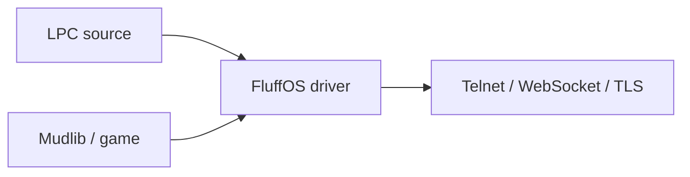

# MudOS, LPMUD, and LPC

**FluffOS** is the LPMUD driver you want today. It is the actively maintained
**MudOS** successor: an **LPC** compiler and virtual machine plus Telnet,
WebSocket, and TLS. Existing MudOS mudlibs still run.

This page is the short glossary. To boot a game: [pick a mudlib](start).
Language reference: [LPC](lpc/). Assistants: [/llm](llm).

## What is LPMUD?

**LPMUD** (also spelled **LPMud**) is a way to build a persistent multiplayer
text world. Lars Pensjö’s original LPMud (1989) split the stack in two:

| Piece | Role |
|---|---|
| **Driver** | Engine: compiles LPC, runs the VM, owns sockets, timers, and efuns |
| **Mudlib** | The game: rooms, commands, login, combat — a tree of LPC files |

Two games can share one FluffOS binary and feel nothing alike. That split is
what “LPMUD” means. FluffOS is a current LPMUD driver.

Related lines (not FluffOS): LDMud, DGD. Those are other drivers. This site
documents FluffOS only.

## What is MudOS?

**MudOS** is an LPMUD driver from the 1990s — an LPC compiler and VM that
many long-running games still remember. It is **not maintained**.

**FluffOS is the MudOS successor.** It stays compatible with MudOS mudlibs
and adds UTF-8, WebSocket, TLS, async database I/O, promises / `async` /
`await`, and a current CMake build. If you have a MudOS tree, move it to
FluffOS `master` (not the unsupported v2017 branch).

| You searched | Use this |
|---|---|
| MudOS download / MudOS source | [github.com/fluffos/fluffos](https://github.com/fluffos/fluffos) |
| MudOS documentation | This site: [https://www.fluffos.info](https://www.fluffos.info) |
| MudOS vs FluffOS | Same family. FluffOS is the one still released. |

## What is LPC?

**LPC** (Lars Pensjö C) is the language LPMUD games are written in.
It looks like C: `if`, `for`, functions, braces. It is not C.

- Every room, item, NPC, and player is an **object**
- The driver compiles LPC to bytecode and runs it
- Memory is garbage-collected; there is no `malloc()` / `free()`
- You can update objects while the game is up
- The driver exposes **efuns** (built-in functions) and calls **applies**
  (callbacks such as `create()` and `heart_beat()`)

FluffOS’s LPC dialect is the one this site specifies:
[language reference](lpc/), [efuns](/efun/), [applies](/apply/).
Editor setup: [dev environment](lpc/dev-environment).

LPC is not Pike, not LDMud’s dialect, and not a general-purpose C compiler.
If you want the language that MudOS / FluffOS mudlibs use, you want this LPC.

## How the three fit together

1. You write (or choose) a **mudlib** in **LPC**
2. **FluffOS** (the driver, MudOS’s successor) compiles and runs it
3. Players connect over Telnet, a browser WebSocket, or TLS

The driver repo’s `testsuite/` is an LPC **test harness**, not a starter
world. Pick a real mudlib first.

## Start here

- **Play / run a game:** [From zero to a running mud](start) — Dead Souls,
  Lima, 泥潭, 侠客行, or a slug from [fluffos/mudlibs](https://github.com/fluffos/mudlibs)
- **Language:** [LPC](lpc/) · [efuns](/efun/) · [applies](/apply/)
- **MudOS upgrade:** [Build from Source](build) on `master`, then point a
  config at your existing mudlib. Do not stay on v2017.
- **Org map:** [ecosystem](ecosystem)

## FAQ

**Is FluffOS the same as MudOS?**
Same role (LPMUD driver), same mudlib family. FluffOS is the maintained
fork/successor. New work happens here.

**Can I run a MudOS mudlib on FluffOS?**
Usually yes. Use current `master`. Expect config and a few LPC touch-ups
on older trees (many READMEs still say v2019).

**Where is the LPC specification?**
[https://www.fluffos.info/lpc/](https://www.fluffos.info/lpc/) — types,
constructs, preprocessor, and diagnostics for this driver.

**What about “LP mud” or “LP MUD”?**
Those searches mean LPMUD / LPMud. This site is that stack’s current
FluffOS docs.
