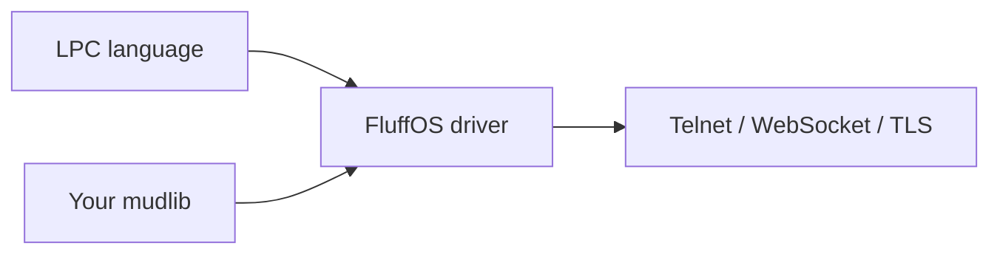

# From zero to a running mud

FluffOS is the **engine**. A **mudlib** is the game. Pick a lib first, then
build the driver and point a config at it.

Paste-into-an-assistant version: **[https://www.fluffos.info/llm](https://www.fluffos.info/llm)**.
After the lib is chosen, drop [Mudlib AGENTS.md](mudlib-agents) into that
tree so the next session keeps ports and the master path.

## The three layers

| Layer | What it is |
|---|---|
| **LPC** | Language for rooms, NPCs, commands — [reference](lpc/). Glossary: [MudOS, LPMUD, LPC](lpmud) |
| **Driver** | Compiler, VM, efuns, Telnet / WebSocket / TLS — this repo’s `src/` |
| **Mudlib** | The game. You choose it. The driver does not ship one you would play. |



`testsuite/` in the driver repo is the LPC **test harness**, not a starter
world. Use it only when you are changing FluffOS itself.

## 1. Pick a mudlib

You need a path on disk or a git URL.

**Already have a lib?** Use that. Generate or edit *its* config.

**Want an English full game?**
[Dead Souls](https://github.com/fluffos/dead-souls) — `git clone --recurse-submodules https://github.com/fluffos/dead-souls.git` then `./build.sh && ./run.sh`. Browser [http://localhost:5555](http://localhost:5555), telnet `:6666`. Docs: [dead-souls.net](https://dead-souls.net/).

**Want a modular English lib?**
[Lima](https://github.com/limalib/lima) — clone with `--recurse-submodules`, then `cd adm/dist && ./rebuild`, often port `7878`. Play: [lima.lostsouls.org](https://lima.lostsouls.org). [Install guide](https://docs.limamudlib.dev/Installation.html). Org snapshot: [fluffos/lima](https://github.com/fluffos/lima).

**Want a smaller historic English lib?**
[Nightmare 3](https://github.com/fluffos/nightmare3).

**Want a Chinese classic?**
- Play in the browser first: [https://mudlibs.fluffos.info/](https://mudlibs.fluffos.info/) (~199 restored games: 侠客行, 风云, 东方故事, 西游记, 书剑, 笑傲江湖, …)
- Then clone [fluffos/mudlibs](https://github.com/fluffos/mudlibs) and `cd libs/<slug>`
- Or a single snapshot: [泥潭 7](https://github.com/fluffos/nt7), [侠客行 100](https://github.com/fluffos/xkx100), [三国志](https://github.com/fluffos/sanguozhi)

More: [ecosystem](ecosystem).

## 2. Build the driver

Skip this if the lib’s own `./build.sh` or Lima’s `cd adm/dist && ./rebuild` already builds FluffOS.

Ubuntu / Debian / WSL (repo on the Linux filesystem, not `/mnt/c`):

```bash
sudo apt update
sudo apt install -y build-essential cmake bison expect \
  libmysqlclient-dev libpcre3-dev libpq-dev libsqlite3-dev \
  libssl-dev libz-dev telnet libjemalloc-dev libicu-dev \
  libgtest-dev pkg-config libffi-dev

git clone https://github.com/fluffos/fluffos.git
cd fluffos
mkdir build && cd build
cmake -DCMAKE_BUILD_TYPE=RelWithDebInfo ..
make -j"$(nproc)" install
```

Binary: `build/bin/driver`. Other platforms: [build guide](build).
Or `docker pull ghcr.io/fluffos/fluffos:master`.

## 3. Config and boot

Prefer the config the mudlib ships. Otherwise:

```bash
/path/to/fluffos/build/bin/driver --generate-config > /path/to/mudlib/config.cfg
```

Set `name`, absolute `mudlib directory`, `master file`, `include directories`,
and `external_port_1 : telnet <port>` (do not also add `port number`).

```bash
cd /path/to/mudlib
/path/to/fluffos/build/bin/driver CONFIG_FILE
```

`mudlib directory : ./` means the process cwd **is** the mudlib root.

Connect with telnet or the websocket URL that lib documents. First wizard
account is lib-specific — read *that* README.

## 4. Leave a trail

Copy [Mudlib AGENTS.md](mudlib-agents) into the mudlib root and fill the
TODOs (ports, master path, how to wiz).

## 5. Where to go next

1. [Dev environment](lpc/dev-environment) — VS Code / Cursor plugin, LPC highlighting, formatter
2. [LPC](lpc/) · [Applies](/apply/) · [Efuns](/efun/)
3. [Concepts](/concepts/) — objects, simul_efuns, [hot reload](concepts/general/hot_reload), [async](concepts/general/async)
4. [Runtime config](driver/config)
5. [Troubleshooting](bug)
