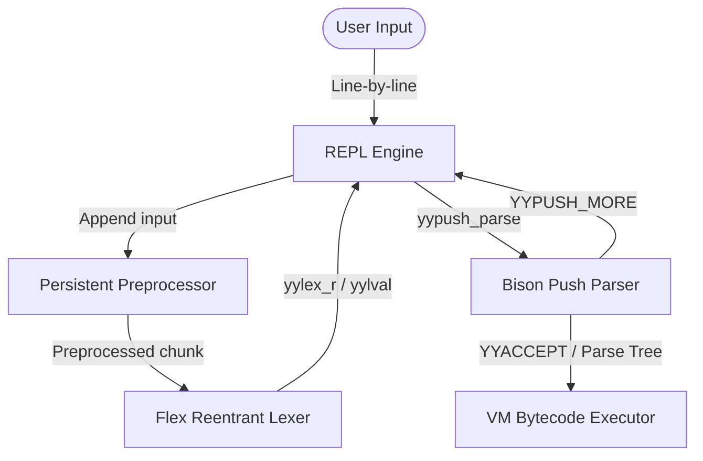

# Design Plan - Bison Push-Parser & Flex Reentrant Stream Integration for REPL

This document outlines the architecture, implications, and implementation steps for migrating the LPC driver's parser and lexer to a push-based model. The ultimate goal of this migration is to support a high-performance, memory-resident Interactive REPL (Read-Eval-Print Loop) inside FluffOS without requiring disk I/O or temporary file compilation.

> **Follow-on plan:** `plans/unified-push-lexer.md` — merge the standalone
> preprocessor into the lexer entirely (stack-based `#include`, all other `#`
> directives handled inline during scanning), making the whole lexing process
> push-driven one token at a time. That plan subsumes/retires the sentinel-
> marker `#pragma`/`#line` design and the `PreprocessingLexStream` whole-chunk
> pass documented below.

---

## 1. Architectural Overview & Context

In a standard compiler (like the current FluffOS compilation cycle), parsing is driven by a pull-model (`yyparse()`), which calls `yylex()` to fetch tokens sequentially from a static file stream until `YYEOF` is reached.

For an interactive REPL, this pull model is insufficient:
1. **Interactive Input Line-by-Line**: The user enters input interactively. We do not have the complete program at the start.
2. **Incomplete Expressions**: If a user types an incomplete statement (e.g., `if (x > 0) {` or a multiline string literal), the compiler must recognize that it is incomplete, suspend parsing, prompt for secondary input, and resume parsing where it left off.
3. **Persistent Compiler State**: Unlike a one-shot file compilation, a REPL needs to maintain local/global variable definitions, defined classes, and functions across separate lines of input.

### The Solution: Bison Push Parsing & Reentrant Flex Streams



---

## 2. Key Implications & Critiques

### A. Parser Purity and State Isolation
- **Pure Parser (`%define api.pure full`)**:
  Bison will no longer use global variables like `yylval` or `yychar`. All parser state is encapsulated.
- **Push Parser (`%define api.push-pull push` or `both`)**:
  Instead of calling `yyparse()`, we initialize a parser state using `yypstate_new()`. We then loop, calling `yypush_parse(pstate, token, &yylval)`.
  - If it returns `YYPUSH_MORE`, we prompt the user for more input.
  - If it returns `0` (success), the parse tree is complete.
  - If it returns `1` (syntax error), we report the error and discard the active statement state.

### B. Flex Lexer Reentrancy and Multi-Line State Preservation
- **State Preservation**: The lexer has internal states (like `SC_STRING_BODY` for strings, `SC_TEMPLATE_BODY` for templates, block comment states, heredoc states, etc.).
- When input is paused to wait for the next line, the Flex scanner state must remain active and suspended. By configuring `%option reentrant`, the parser keeps a `yyscan_t` handle. The state can be safely reused for the next line of input.
- **Push Lexer / Input Buffering**:
  Instead of setting up file descriptors, the REPL engine can append input strings directly to the scanner using `yy_scan_string()` or custom stream buffers, processing them incrementally.

### C. Persistent Preprocessor Macro Tables (CRITICAL DESIGN ISSUE)
- **Problem**: If we instantiate a fresh `LpcPreprocessor` for every interactive line, macros defined on previous lines (e.g. `#define FOO 42`) will not be expanded on subsequent lines.
- **Solution**: The `LpcPreprocessor` instance must be persistent. We must expose a method on `LpcPreprocessor` to process a single line of input using the existing defines registry (`defines_`), appending the preprocessed output to a feed buffer without clearing the preprocessor state.

### D. Memory Safety Under Exception Unwinding (CRITICAL SAFETY ISSUE)
- **Problem**: FluffOS uses C++ Exception-based `throw_error()` for compiler/parser error handling (via `yyerror()`). If a compile error occurs, the VM propagates a C++ exception immediately to unwind the stack. Although this triggers destructors for C++ stack-allocated objects, raw C heap allocations (like the Flex scanner `yyscan_t` and Bison parser state `yypstate`) do not have destructors and will be leaked.
- **Solution**: We must wrap both `yyscan_t` and `yypstate` in C++ RAII containers (such as custom `std::unique_ptr` with custom deletors for `yylex_destroy` and `yypstate_delete`) to guarantee safe deallocation during stack unwinding.

### E. Symbol Table Lifetime & Scope Persistence
- **Problem**: When a compilation ends, local variables are removed from the symbol table. In a REPL, a user expects local variables defined in the REPL session to persist between lines.
- **Solution**: The REPL context must map local variables to a pseudo-global scope (similar to object-global variables), allowing them to remain in the compiler's symbol table across individual statements.

---

## 3. Implementation Phases

```
┌─────────────────────────────────────────────────────────────┐
│ Phase 1: Reentrant Lexer & Parser (Purity foundation)        │
└──────────────┬──────────────────────────────────────────────┘
               ▼
┌─────────────────────────────────────────────────────────────┐
│ Phase 2: Bison Push-Parser Configuration                    │
└──────────────┬──────────────────────────────────────────────┘
               ▼
┌─────────────────────────────────────────────────────────────┐
│ Phase 3: Persistent REPL Context & Memory-only Compiler      │
└──────────────┬──────────────────────────────────────────────┘
               ▼
┌─────────────────────────────────────────────────────────────┐
│ Phase 4: Mudlib REPL Efun Integration                        │
└─────────────────────────────────────────────────────────────┘
```

### Phase 1: Reentrant Lexer & Parser (Purity) — DONE
- Configure `lex.l` with `%option reentrant` and `grammar.y` with `%define api.pure full`.
- Implement `compiler_context_t` to hold template/brace states, eliminating global variables.
- Wrap `yyscan_t` in a scope-local RAII guard (`std::unique_ptr<void, ...>` around `yylex_init_extra`/`yylex_destroy`) inside `compile_file()`.
- `current_line`, `current_file`, and the rest of the compiler's transient globals (`mem_block`, `comp_trees`, `string_idx`/`string_tags`, `type_of_locals`/`locals`, etc.) are saved/restored around every `compile_file()` call via a `DEFER` block, so the machinery is in place for a future nested/recursive compile even though...
- ...the original `guard`-based reentrancy check (`if (guard || current_file) error("Object cannot be loaded during compilation.\n");`) was deliberately **kept**, not removed. Reentrant lexer/parser state is real infrastructure needed for the REPL regardless of whether `compile_file()` itself is ever called recursively; actually allowing recursive `compile_file()` calls is a separate decision deferred to Phase 3/4. Note for whoever lifts the guard later: the current save/restore block does **not** yet cover everything `start_new_file()`/`prolog()` mutates — it's missing `current_stream`, `cur_lbuf`/`head_lbuf`, `inctop`/`incnum` (include stack), `current_function_context`/`last_function_context`/`function_context_stack`, and `inherit_file`. These are all file-scope statics in `lexer_utils.cc`/`compiler.cc` that would need saving too before the guard can safely come out.
- Self-review caught and fixed two real bugs introduced by the reentrancy conversion (both verified via a 240-case unit test run + the full LPC testsuite): `YY_PENDING_LOOKAHEAD()` in `lex.l` was computing lookahead relative to the current token's start (`yyg->yytext_ptr`) instead of the buffer start (`YY_CURRENT_BUFFER_LVALUE->yy_ch_buf`), which would over-rewind `outp` for any function-literal/heredoc-terminator/template-continuation token not sitting at buffer offset 0; and `lpc_lex_yy_input()`'s `extern "C"` definition in `lexer_utils.cc` had drifted to a 2-arg signature while `lex.l`'s `YY_INPUT` macro calls it with 3 args (undefined behavior masked by `extern "C"` bypassing signature checking).

### Phase 2: Bison Push-Parser Configuration — DONE, and unified to push-only
- **Decision (superseding the original "both" plan): the driver no longer generates or uses a pull-style parser at all.** `grammar.y` is `%define api.push-pull push` (not `both`) — Bison no longer emits `yyparse`/`yypull_parse` at all, only `yypush_parse`/`yypstate_new`/`yypstate_delete`/`YYPUSH_MORE`. `compile_file()` in `compiler.cc` now drives every compile — REPL or not — through a manually-written `do { token = yylex(...); status = yypush_parse(pstate, token, ...); } while (status == YYPUSH_MORE);` loop, with `pstate` owned by a `std::unique_ptr<yypstate, ...>` RAII wrapper (the plan's Section D safety requirement) and a null-`pstate` guard mirroring what Bison's own generated `yyparse()` used to do for OOM. This loop is textually identical in shape to what Bison's now-deleted `yypull_parse()` did internally, so behavior for a normal whole-file compile (every token available immediately, loop runs to completion in one call) is unchanged — verified by the full 246-test unit suite and the full LPC testsuite (`driver-autotest`) both passing with zero regressions after the switch. The property this doesn't yet exercise — pausing the loop between tokens and resuming later with the same `pstate`/scanner — is untested in isolation; it will be exercised for real (and thus validated) by the REPL/`lpcshell` work in Phase 3/4, which depends on it working.
- `int yyparse(void *yyscanner);` forward declarations removed from both `grammar.y`'s prologue and `compiler.cc` (grep-confirmed no other caller anywhere in `src/`).

### Phase 3: Persistent REPL Context & Memory-only Compiler — in progress
- **Persistent macro definitions inside `LpcPreprocessor` — DONE, and unified to push-only.** `LpcPreprocessor`'s public API is now *only* `make_session()` + `preprocess_next(source, filename)` + `errors()` — the old one-shot constructors (`LpcPreprocessor(stream, filename)`, `LpcPreprocessor(source, filename)`) and the `preprocess()` method were removed entirely, not just left as a parallel path. A session owns one long-lived `Impl`; `preprocess_next()` resets only the input-side state (`src_`, `pos_`, `out_`, `filename_`, `current_line_`, `local_errors_`) between calls while leaving `local_defines_` (the `#define` table), `cond_stack_`, and `template_brace_stack_` untouched — so a macro defined in one call is visible when preprocessing the next. This is *not* a general incremental/resumable preprocessor: each call's source must be self-contained w.r.t. `#if`/`#endif` nesting (an unclosed conditional at the end of one chunk reports "missing #endif" the same way reaching real end-of-file would). The one production caller (`lexer_utils.cc`'s `start_new_file()`, used by every ordinary file compile) now does "one session per compile, one chunk pushed" instead of constructing a one-shot preprocessor — behaviorally identical, verified by the full test suite + LPC testsuite. All ~15 direct-construction call sites in `test_compiler.cc` were migrated to the session API (no test file needed the removed one-shot convenience; where one is wanted it now lives in test code only, per direction, not in the production class). Covered by 6 `PreprocessorSession.*` tests (macro persists across chunks, redefine-across-chunks, independent sessions don't share state, self-contained `#if`/`#endif` works, unterminated `#if` errors, errors reset per chunk).
- Self-review of this round: added a null-`pstate` guard to `compile_file()`'s push-parse loop (parity with Bison's deleted `yyparse()`, since `YYMALLOC` is plain `malloc` and can fail); fixed a stale doc comment at the top of `preprocessor.cc` still describing the removed one-shot usage pattern.
- **Preprocessing merged into the lexer's own pull-based reads — DONE.** Added `PreprocessingLexStream` (`preprocessor.h`/`.cc`), a `LexStream` that wraps a raw source stream and preprocesses it lazily on its first `read()` call, then serves the result byte-range like any other stream. `start_new_file()` in `lexer_utils.cc` no longer has a distinct "slurp the whole file, run the preprocessor, wrap the *result* in a new `StringLexStream`" sequence of steps — it just constructs one `PreprocessingLexStream` wrapping the original raw stream and assigns it to `current_stream`, and the existing ring-buffer/`refill_buffer()` machinery pulls preprocessed bytes through it exactly the way it always pulled raw bytes through a `FileLexStream`. The global-include-file prepending and preprocessor-error-to-`yyerror()` reporting that used to live in `start_new_file()` moved into `PreprocessingLexStream::read()`. The session is held via `std::shared_ptr<LpcPreprocessor>` (not owned outright, not a raw pointer) specifically so a future REPL driver can pass the *same* session into successive compiles to keep macros alive across statements, while today's one-shot file-compile caller just hands each stream its own fresh session. Caveat carried over unchanged from Phase 3's preprocessor-session work: the underlying preprocessor engine (`Impl::run()`) is still a whole-buffer pass, not byte-at-a-time incremental — this class makes the *composition* push/pull-driven (the lexer's normal reads now transparently trigger it), not the preprocessor's internals. Verified via full 246-test suite + full LPC testsuite, zero regressions.
- **`lex.l` extracted into a "pure" thin rule table, mirroring `grammar.y`'s style — DONE.** Added `lexer_rules.h`/`lexer_rules.cc`: nearly all substantive lexer logic (number-literal parsing, string/template escape decoding including the Unicode surrogate-pair handling, char-literal escape decoding, template fragment head/middle/tail closing, `#line` directive parsing, the `_`-digit-separator stripper) moved there as ordinary functions taking explicit `(yyscanner, yytext, yyleng, yylval_param)` parameters, the same shape grammar.y's rules use to call `rule_*()` in `grammar_rules*.cc`. `lex.l` itself shrank from 1095 to 876 lines and its rule actions are now almost all one-line calls into these functions. What's left inline in `lex.l` is, by necessity, only what genuinely can't move: `BEGIN(...)`/`YY_START`/`yyless()` are macros tied to Flex's generated `yyguts_t` type, which is private to the generated `lex.autogen.cc` translation unit and not visible from a separately-compiled `.cc` file — so start-condition transitions and buffer-rewind bookkeeping (`YY_PENDING_LOOKAHEAD`/`outp -=`) had to stay put; this boundary is documented at the top of `lexer_rules.h`. Verified via the full 246-test unit suite (which exercises essentially every escape/overflow/nesting edge case this logic handles) plus the full LPC testsuite, both passing with zero regressions. As a minor reuse win, the string/template escape decoders are now genuinely shared functions (parameterized by `is_template` for wording differences) rather than two near-duplicate inline copies.
- Still needs a design pass before implementation: how a REPL session's *compiler* state (as opposed to preprocessor state) is represented — symbol-table lifetime for locals surviving across statements, and how/whether `compile_file()`'s save-restore machinery from Phase 1 gets used here.
- **`LexTokenStream` — DONE.** Added to `lex.h`/`lexer_utils.cc`: owns a reentrant Flex scanner (RAII: `yylex_init_extra`/`yylex_destroy` in its ctor/dtor) and exposes `load(stream, session)` + `next(&yylval)` + `scanner()`. `compile_file()` in `compiler.cc` no longer wires up scanner creation, the RAII deleter lambda, and the token-pull loop inline by hand — it constructs one `LexTokenStream`, and `prolog()` (whose signature changed from taking a bare `void *yyscanner` to `LexTokenStream &token_stream`) calls `token_stream.load(std::move(stream))` as its last step instead of the free `start_new_file()` directly. `start_new_file()` itself is unchanged in behavior, just gained an optional `session` parameter (defaults to a fresh one, preserving today's behavior) so a future caller can pass the same `LpcPreprocessor` session across multiple `load()` calls on one `LexTokenStream` to keep `#define`s alive across them — the actual point of this class for the REPL: one instance, reused (not reconstructed) across many statements, each `load()` resetting the ring buffer/start-condition exactly like a fresh top-level compile without tearing down and rebuilding the underlying scanner. Explicitly decided (see prior discussion) to leave the byte-level `LexStream` hierarchy (`FileLexStream`/`IStreamLexStream`/`StringLexStream`/`PreprocessingLexStream`) untouched and add this as a separate class rather than changing what `LexStream::read()` means. Known scope boundary, documented at the class: the ring-buffer state `load()` resets via `start_new_file()` (`cur_lbuf`/`head_lbuf`, the `#include` stack, etc.) is still file-scope static in `lexer_utils.cc`, not per-instance — two `LexTokenStream`s alive at once would corrupt each other's buffers. Not a problem today: `compile_file()`'s reentrancy guard already prevents concurrent compiles, and only one `LexTokenStream` exists at a time anywhere it's used. Verified via full 246-test suite + full LPC testsuite, zero regressions.
- `StringLexStream`/`IStreamLexStream` (already existing) plus `compile_file()` already give an entirely in-memory compile path — no filesystem interaction was ever required for compiling *from a stream*; what's actually missing (persistent symbol-table/locals across separate top-level compiles) is a deeper design item, not this bullet. Superseded by Phase 4's "restart pattern" below, which sidesteps needing it for v1 by giving every REPL statement a fresh compile instead of trying to keep one compile-in-progress open across statements.
- **Further `lex.l` extraction — DONE.** Two more pieces of substantive inline logic moved to `lexer_rules.cc`: the `$N`/`$` function-pointer-parameter rule (`lpc_lex_function_param()`, with a `kLpcLexFunctionParamRetry` sentinel for the one case that still needs a visible-in-`lex.l` recursive `yylex()` retry) and, briefly, a directive-keyword classifier that was later made obsolete (see below) and removed again.
- **`LexTokenStream`/`PreprocessingLexStream` relocated into `LexStream.h`, out of `lex.h`/`preprocessor.h`.** Consolidates the whole byte/token stream hierarchy (`LexStream` and subclasses, `PreprocessingLexStream`, `LexTokenStream`) into one file. `LexTokenStream` holds its `compiler_context_t` via `std::unique_ptr<compiler_context_t>` behind a forward declaration (a small Pimpl) instead of by value, specifically so `LexStream.h` doesn't need to pull in `lex.h`'s full definition — the ctor/dtor that actually touch the complete type are still defined out-of-line in `lexer_utils.cc`, which does include `lex.h`. `preprocessor.h` no longer needs to include `LexStream.h` at all now that `PreprocessingLexStream` moved out of it.
- **`#pragma`/`#line` handling: explored moving fully into the preprocessor, reverted after finding a real bug.** The request was to stop having the lexer parse `#pragma`/`#line` itself (4 Flex start-conditions dispatching on keyword text felt like unnecessary lexer complexity for something the preprocessor already recognizes by name). Three designs were tried in sequence:
  1. **Marker-based** (kept, see below): preprocessor emits a compact sentinel (`LPC_PRAGMA_MARKER`/`LPC_LINE_MARKER`, `"\x01P"`/`"\x01L"`, defined in `lex.h`) instead of literal `"#pragma "`/`"#line "` text; the lexer matches each with one flat top-level rule (`^"\001P"[^\n]*` / `^"\001L"[^\n]*`) instead of the old `SC_DIRECTIVE_KEYWORD`/`SC_DIRECTIVE_PRAGMA`/`SC_DIRECTIVE_LINE`/`SC_DIRECTIVE_SKIP` state machine, which is deleted entirely. The *effect* still applies lexer-side (`handle_pragma()`/`lpc_lex_handle_line_directive()`, the latter moved to `lexer_rules.cc`), at the correct token-stream position — this variant is the one actually in the tree.
  2. **Full direct application** (tried, reverted): have the preprocessor call `handle_pragma()`/set `current_line`/`current_file` itself, as it scans, instead of emitting anything. This was tried on explicit direction, on the reasoning that the preprocessor is now a sequential scanner so applying effects "in position order" during its own pass should be equivalent. **It isn't, and this was empirically confirmed broken, not just a theoretical tradeoff**: with `__GLOBAL_INCLUDE_FILE__` configured (as the test config does), every single compile prepends a synthetic `#include <glf>` + `#line 1 "realfile"`. Applying that `#line` directly during preprocessing sets `current_line` to its final value (e.g. 0) *before the lexer runs at all* — but the lexer still independently walks the *entire* preprocessed output from byte 0 afterward, incrementing `current_line` for every physical newline it consumes, including all the ones from the global-include-file's own content that used to be canceled out by the lexer hitting the literal `#line 1 "realfile"` text at the right position. The two counting mechanisms fight instead of cooperating. Debugged with temporary `fprintf` instrumentation and confirmed directly: `LexerTest.Directive_Line_UpdatesCurrentLine` produced `current_line == 162` instead of the expected `101`; `_WithQuotedFilename` produced `112` instead of `51`. This corrupts line numbers on *every* compile that uses the global-include mechanism (i.e. effectively all of them in a real mudlib), not just a mid-file-`#pragma`-toggle edge case. Reverted back to design 1.
  3. A brief intermediate step also removed the classify-by-keyword-text helper (`lpc_lex_classify_directive()`/`LpcLexDirectiveKind`) added for design 1, since design 2 didn't need it — then design 1 was restored without re-adding it, since the marker byte itself (`P` vs `L`) already tells the lexer which rule fired; the keyword-text classification was only ever needed for the old literal-text-dispatch approach.
  - Takeaway for anyone revisiting this: `current_line`/`pragmas` are fundamentally tied to *when the lexer consumes a given physical position*, not to preprocessing order, because the preprocessor's pass (even though it's now itself sequential/position-aware internally) completes entirely before the lexer sees any output. Making this genuinely preprocessor-owned would require either byte-at-a-time interleaving between preprocessing and lexing (a much larger rewrite of `LpcPreprocessor::Impl::run()`'s internals — see the "not byte-at-a-time incremental" bullet above) or restructuring how `current_line` itself is tracked (e.g. a line-mapping table instead of a live incrementing global) — both out of scope here.
- **`src/compiler/internal/README.md` rewritten** to describe the current architecture (it previously described the pre-migration pull-parser/global-lexer-state design). Covers the stream layer, the push-only parser, `lexer_rules.cc`, and the `#pragma`/`#line` design-exploration outcome above.

### Phase 4: `lpcshell` — Interactive REPL Binary — DONE (v1, working)
- **`lpcshell` is a real, working binary.** `src/main_lpcshell.cc` + a new CMake target (alongside `driver`/`lpcc`). Boots identically to `lpcc` (`init_main(config)` + `vm_start()` — same config/master/simul_efun/mudlib loading), then runs a read-eval-print loop against stdin/stdout with a `>>> ` prompt and `... ` continuation prompt. Confirmed interactively: expression evaluation and auto-print (`1 + 1` → `2`), multi-line continuation (`if (1) {` prompts `...` until the matching `}`), side effects (`write(...)`), and — the hard part — **variable values persisting across separate statements** (`int x = 5;` then `x + 10` on the next line correctly gives `15`).
- **Design actually used (the "restart pattern" flagged as the pragmatic alternative during earlier planning):** each statement compiles as its own fresh in-memory object via a new `load_object_from_source(source, virtual_name, callcreate)` in `simulate.cc`/`.h` (a stripped-down sibling of `load_object()` — same post-compile object setup, but takes a `StringLexStream` directly instead of opening a real `.c` file, and doesn't support `#inherit`, since there's no filename for the existing "reload the inherited file, then reload this one" dance to target). This reuses the entire existing, fully-tested `compile_file()` pipeline unchanged rather than requiring the persistent-symbol-table design the earlier phases left open — at the cost of not sharing a real compiler symbol table across statements.
  - **Expression vs. statement:** the typed text is tried first as `return (<text>);` inside a synthetic function (auto-printed via `string_print_formatted("%O", ...)`, the same formatter `printf("%O", ...)`/`sprintf("%O", ...)` use); if that fails to compile, it's retried as a plain statement body (no auto-print). A cheap regex pre-check (`^(if|for|while|do|switch|return|break|continue|\{)`) skips the doomed expression attempt for obvious statement keywords, since the compiler logs syntax errors to the console as it finds them, not just when an exception is eventually thrown — so a "trial" attempt is never silent the way it would be in a real incremental parser.
  - **Variable value persistence:** the session tracks every variable name it has ever seen declared and redeclares them all as `mixed` globals (via a text preamble) in every subsequent statement's synthetic object; values round-trip through the existing `save_variable()`/`restore_variable()` LPC efuns, called from *generated LPC source text* (not by linking against their C++ implementations) — a `__lpcshell_snapshot()` function returning `({save_variable(x), ...})` is compiled alongside `__lpcshell_eval()` and applied right after it to pull updated values back into the C++ session state as a string array.
  - **Completeness check** for the continuation prompt is a small hand-rolled character scanner (not the real lexer): tracks `()`/`{}`/`[]` depth while correctly skipping over string/char/template literals and comments. Heredocs are not tracked by it — a heredoc spanning lines will surface as a compile error rather than prompting for more input.
  - **New-declaration detection** is a single-variable regex (`^\s*(int|float|string|object|mixed|mapping|function|buffer)\s*\*?\s*name\s*(=...)?;\s*$`); on match, the type keyword is stripped and the statement is rewritten to a plain assignment/no-op targeting the new global instead of shadowing it with a function-local. `int x, y;` (multiple names in one declaration) is not recognized.
- **Real bug found and fixed during interactive testing:** a semantic error (e.g. "Undefined variable") partway through one function's body corrupted the parser's recovery badly enough to garble the *next* function textually following it in the same compile unit (a bogus "unexpected '}'" pointing at that next function's signature). Fixed at the lpcshell level by generating `__lpcshell_snapshot()` *before* `__lpcshell_eval()` in the source text, so the user's (possibly-erroring) code is always last with nothing after it left to corrupt. Not chased further as a compiler-level fix given time constraints — worth revisiting if it turns out to affect normal (non-REPL) multi-function files too; nothing in today's session's changes obviously touches error-recovery code paths in `grammar_rules*.cc`, so this may well be a pre-existing characteristic rather than a regression.
- **Known v1 rough edges** (acceptable for a first working version, listed for whoever picks this up next):
  - A failed "trial" expression compile still logs its syntax error to the console before silently falling back to statement form, for any input the regex pre-check doesn't catch.
  - Assignment/function-call expressions get their result auto-printed even for likely-statement-intent input (e.g. `write("hi\n");` prints `hi` *and* `0`, since `write()`'s return value is a valid expression result) — LPC has no `None`-like sentinel for the REPL to specially suppress the way Python suppresses printing for `None`.
  - A double error message ("Undefined variable 'x'" immediately followed by a spurious "syntax error, unexpected '}'") appears for an undefined-variable reference used as a statement on its own (e.g. typing just `x` when `x` was never declared) — same likely-pre-existing error-recovery characteristic as above, one function, not the cross-function case.
  - Real diagnostic text for a failed statement never reaches lpcshell's own C++ code to format nicely: `error()`'s C++-exception unwind path always throws the generic literal `"error handler error"`, with the actual `file line N: message` text already printed directly to the console by the driver's own logging before that throw — so lpcshell deliberately doesn't try to re-print `error_message` itself (see the comment at the end of `Eval()`).
- **What's still genuinely deferred** (the harder, "real" fix noted throughout earlier phases): a persistent compiler symbol table so REPL locals are real, first-class variables in one continuously-open compile, rather than textually-redeclared globals round-tripped through `save_variable()`/`restore_variable()` between independent compiles. The restart-pattern v1 above is a deliberate, pragmatic substitute for that, not a step toward it — revisiting it would mean touching `grammar_rules*.cc`/symbol-table lifetime directly, the piece every earlier phase in this document flagged as needing its own design pass.
