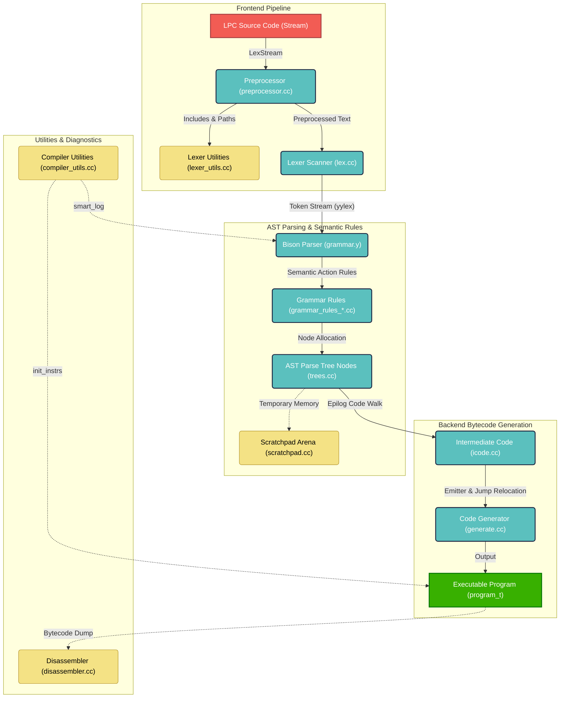

# FluffOS Compiler Subsystem (`src/compiler/internal/`)

This directory contains the core compiler, parser, lexer, preprocessor, and bytecode generation frontend of the FluffOS LPMUD VM.

---

## Overall Subsystem Architecture

The following diagram illustrates the complete data flow, source files, and compilation stages from raw LPC source files to executable VM program memory (`program_t`):

---

## Module Responsibilities

### 1. Preprocessor (`preprocessor.cc`, `preprocessor.h`)
- **Responsibility**: A modern, stateless C++ C-preprocessor.
- **Details**: Operates on `std::string` and `std::string_view` with zero global state. Handles `#define`, `#undef`, conditional compilation (`#if`, `#ifdef`, `#ifndef`, `#elif`, `#else`, `#endif`), include resolution, stringizing, token pasting, comments stripping, and `@`/`@@` heredocs literal boundaries.

### 2. Lexer (`lex.cc`, `lex.h`)
- **Responsibility**: Reads preprocessed output and feeds grammatical tokens to the Bison parser.
- **Details**: Handles keyword resolution, identifier lookups, constant evaluation, and maintains the global compiler identifier hash table (`ident_hash_table`).

### 3. Bison Parser (`grammar.y`, `grammar.autogen.cc`, `grammar.autogen.h`)
- **Responsibility**: LALR(1) parser definitions compiled via Bison.
- **Details**: Decodes LPC grammatical constructs and invokes AST node creation functions in `grammar_rules.cc`.

### 4. Grammar Rules & AST (`grammar_rules.cc`, `grammar_rules_*.cc`, `trees.cc`, `trees.h`)
- **Responsibility**: Abstract Syntax Tree (AST) node representations and compiler semantic rule checks.
- **Details**: Performs type check validations and structures code blocks, switches, and loops.

### 5. Intermediate Code (`icode.cc`, `icode.h`)
- **Responsibility**: Translates AST nodes into intermediate VM instructions representation.

### 6. Bytecode Emitter (`generate.cc`, `generate.h`)
- **Responsibility**: Generates binary instructions in execution format, optimizing jumps, and compiling `program_t` structures.

### 7. Core Compiler Driver (`compiler.cc`, `compiler.h`)
- **Responsibility**: The central orchestrator that initiates the pipeline.
- **Details**: Manages compiler memory blocks, runs `prolog` setup, initiates parser execution (`yyparse`), and builds final program metadata (`epilog`).

---

## Key Utility Modules

- **`LexStream.h`**: Stream abstraction allowing file-based or memory-based reading for the preprocessor.
- **`lexer_utils.cc`, `lexer_utils.h`**: Holds scanner-specific utilities such as include path resolving, directory include files opening, and default predefine list management.
- **`compiler_utils.cc`, `compiler_utils.h`**: Houses compiler-wide diagnostics (`smart_log`) and system instruction setup (`init_instrs`).
- **`scratchpad.cc`, `scratchpad.h`**: High-performance scratch memory arena for temporary compile allocations.

---

## Important Guidelines

1. **Header Inclusion Order constraint**:
   - `grammar.autogen.h` references Bison semantic types `decl_t` and `func_block_t` which are declared in `compiler/internal/grammar_rules.h`.
   - Therefore, any compiler file including `grammar.autogen.h` must include `compiler/internal/grammar_rules.h` **before** it.

2. **Global Header Inclusion Rule**:
   - Every source file (`.cc` / `.c`) in the driver (excluding `base/` and `packages/`) **must** include `"base/std.h"` as its very first line.
   - Follow it with a blank line to clearly separate it from other includes.
