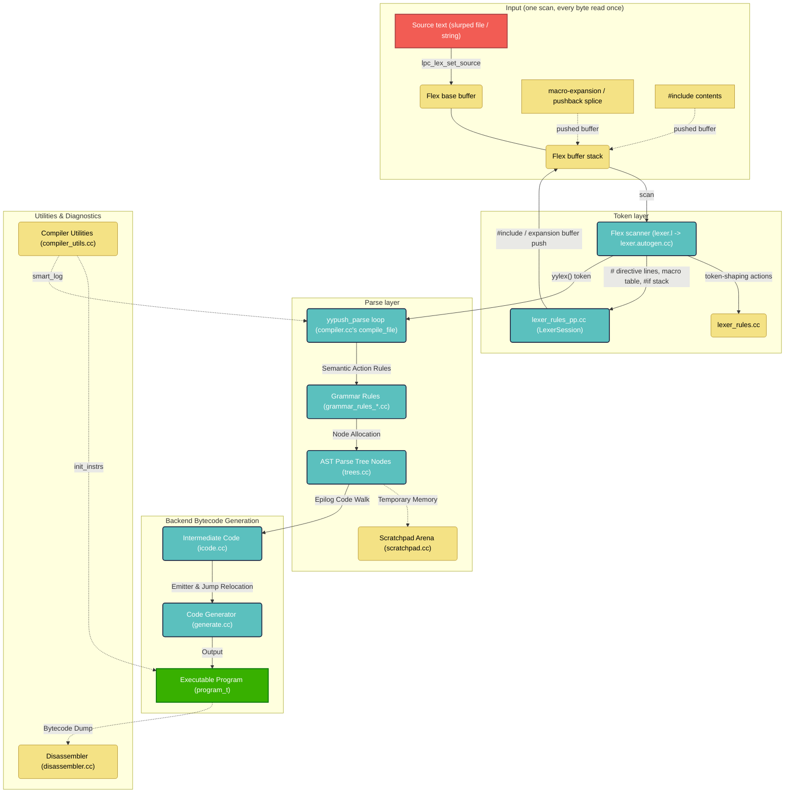

# FluffOS Compiler Subsystem (`src/compiler/internal/`)

This directory contains the core compiler, parser, lexer, preprocessor, and bytecode generation frontend of the FluffOS LPMUD VM.

This frontend was rebuilt around genuinely Flex-native mechanisms and a push parser, laying groundwork for an interactive REPL (`lpcshell`, `src/main_lpcshell.cc`). The sections below describe the current design — in particular: `yyparse()` no longer exists (push-parser only), **there is no separate preprocessor** (preprocessing is part of the lexer's one scan; the old standalone `preprocessor.cc` engine was deleted), the lexer is a reentrant Flex scanner threaded through explicit `yyscanner` handles rather than global state, and there is **no hand-rolled input buffer and no byte-stream abstraction** — the main file is slurped and installed as the base in-memory buffer while macro expansions and `#include` contents ride on Flex's own buffer stack.

---

## Overall Subsystem Architecture

---

## Module Responsibilities

### 1. Input layer (`lexer_utils.cc`)
- **There is no byte-stream or token-stream abstraction — the scanner IS the interface.** `compile_file()` (and `stage_output.cc`) create a reentrant Flex scanner directly (`yylex_init_extra`, destroyed by a scope guard declared BEFORE the cleanup guard, so unwind teardown never touches a destroyed scanner), point it at source with `start_new_file(view, scanner, session)` or `start_new_file_fd(fd, ...)` (zero copy: `read(2)` lands the bytes in the arena block flex scans in place via `yy_scan_buffer`), and pull tokens with plain `yylex()`. `#include` contents and macro splices use the same in-place mechanism, so every input in the compiler is one kind of thing: an in-memory Flex buffer over arena memory. The historical `LexStream` hierarchy, the `LexTokenStream` wrapper, and the `YY_INPUT` refill bridge are all gone. Whoever destroys a scanner calls `lpc_lex_scanner_destroyed()` first (clears the active-scanner global; an aborted compile skips `end_new_file`, and stale reads were a real use-after-free pinned by `CompileEntry.FatalAbortThenRecompile`). `session` is a `LexerSession` (see Module 2); passing one across `start_new_file` calls keeps `#define` state alive between REPL chunks.

### 2. Preprocessing (`lexer_rules_pp.cc`, `lexer_rules_pp.h`) — part of the lexer's single scan
- **There is no separate preprocessor.** Preprocessing is a set of lexer rule actions inside the one and only scan: every byte of source is read exactly once, and each directive's effect applies at exactly its position in the token stream — which makes position-sensitive directives (`#pragma no_warnings` mid-file, `#line`) correct by construction, with a single `current_line` counter (native Flex state, `%option yylineno`) nothing else fights.
- **`lexer_rules_pp.cc` holds the preprocessing logic**: the macro table (`LpcMacroTable`, a plain map of `PpMacro`), `#define`/`#undef` parsing, the `#if`/`#elif` expression evaluator (`lpc_lex_eval_if_expr()`, which evaluates over TOKENS pulled through the scanner — see below), the conditional stack (`CondState`), `#` stringizing and `##` pasting via `substitute()` (`##` exists only inside macro bodies), `__LINE__`/`__FILE__`/`__DIR__` from the live scan position (`lpc_lex_builtin_macro()`), and the single directive entry point (`lpc_lex_on_directive()`) that lexer.l's one anchored `#`-line rule calls for BOTH scan modes. The only remaining textual macro expansion (`lpc_lex_expand_string()`) is for function-like ARGUMENT pre-expansion and `#include`'s unquoted-filename form; ordinary expansion is rescan-driven (see Module 1).
- **`LexerSession`** (in `lexer_rules_pp.h`) is the persistence unit: macro table + conditional stack, held by `shared_ptr`. A normal file compile gets a fresh session per `start_new_file()`; a REPL can pass one session across chunks to keep `#define`s alive (each chunk must still be `#if`-balanced; an unterminated `#if` reports "Missing #endif" at EOF and the stack is cleared so the session stays usable).
- **How each directive is handled**: `#define`/`#undef` mutate the session's macro table (redefining a macro with a different body is a non-fatal warning — the new definition wins); `#if`/`#ifdef`/`#ifndef`/`#elif`/`#else`/`#endif` drive the conditional stack — a false branch switches the scanner into the `SC_COND_SKIP` start condition, which consumes lines *without tokenizing them* (dead code may be deliberately invalid); the `#if`/`#elif` expression is evaluated over TOKENS: the expression text is pushed as a dedicated buffer and pulled through the scanner (numbers via the real literal decoders, macro references expand through the ordinary rescan path into a flat token sequence preserving C precedence, `defined()`/`efun_defined()` operands pulled with expansion suppressed). `#include` slurps the opened file and pushes its whole content as a Flex buffer, recording only metadata on the include stack (pop at that buffer's `<<EOF>>` — stack-based, no recursion, no eager expansion); `#pragma`/`#line`/`#error`/`#warn`/`#echo` apply immediately in place.
- **Macro expansion happens at identifier-resolution time**, not as a text pre-pass: `lpc_lex_resolve_identifier()` (lexer_utils.cc) consults the macro table before the identifier hash; a hit pushes the RAW (parameter-substituted) body as a fresh Flex buffer and NESTED references expand when the rescan reaches them (collecting `(...)` arguments through `lpc_lex_getc()` for function-like macros — reads that transparently cross a drained splice buffer into its parent). Self-reference termination is the set of LIVE expansion-buffer frames: a macro's own name is resolved as a plain identifier while any live expansion buffer carries it as a guard. One provenance frame per live expansion buffer provides the "during expansion of macro ..." diagnostic notes. Because string/char/template bodies are scanned by their own start conditions and never reach identifier resolution, "no expansion inside strings/templates/heredocs" falls out for free — no parallel quoting-rule implementations to keep in sync.

### 3. Lexer (`lexer.l`, `lexer.autogen.cc`, `lexer.h`)
- **Responsibility**: THE scan — a reentrant Flex scanner (`%option reentrant`, threaded via an explicit `void *yyscanner` handle, no global lexer state) that turns raw LPC source (preprocessing included, per Module 2) into a token stream for the parser, one token's worth of work per `yylex()` pull.
- **`lexer.l` is a thin rule table, not where the logic lives.** Mirroring how `grammar.y`'s actions mostly call a `rule_*()` function defined in `grammar_rules*.cc`, almost every substantive computation a lexer.l rule needs lives in ordinary functions: token-shaping logic (number-literal parsing, string/template escape decoding including Unicode surrogate pairs, char-literal escape decoding, template-fragment closing, `$N` function-pointer parameters) in **`lexer_rules.cc`**, preprocessing logic in **`lexer_rules_pp.cc`** (Module 2). What's left inline in `lexer.l` is, by necessity, only what can't move: Flex hides its scanner state (`yyguts_t`, `BEGIN()`/`YY_START`, `yyless()`) as macros/types private to the generated `lexer.autogen.cc` translation unit, invisible to a separately-compiled `.cc` file — so start-condition transitions and the buffer-stack helpers (`lpc_lex_push_string_buffer()`, `lpc_lex_pop_pushed_buffer()`, `lpc_lex_getc()`, the error-context buffer walk) live in `lexer.l`'s trailer.
- **The directive rule consumes its terminating newline BEFORE dispatching** (documented at the rule): one `yyinput()` call — which also maintains Flex's beginning-of-line flag — so an `#include`'s stack entry records the line AFTER the directive as the parent's resume line. The push/pop bookkeeping mirrors the legacy scanner's `save_file_info`/`current_line_base` arithmetic verbatim.
- **`compiler_context_t`** (declared in `lexer.h`) holds all per-scanner-instance lexer state (template nesting/brace-depth tracking, the string/template accumulator, heredoc terminator, the token's start column, the `SC_COND_SKIP` nesting depth, the `#if`-evaluator expansion-suppression flag) that used to be static globals — reached from `lexer.l`/`lexer_rules*.cc` via `yyget_extra(yyscanner)`.
- **`lexer_utils.cc`** also hosts the hand-written helpers that can't be static Flex patterns: heredocs (`parseHeredoc()` — the closing terminator is supplied by the LPC source itself at compile time; the body is read line-by-line through `lpc_lex_getc()`, i.e. through Flex's own buffers) and main-file EOF (`parseMainEof()`).

### 4. Bison Parser (`grammar.y`, `grammar.autogen.cc`, `grammar.autogen.h`)
- **Responsibility**: LALR(1) parser definitions compiled via Bison, `%define api.pure full` (no global `yylval`/`yychar`) and **`%define api.push-pull push`**.
- **There is no `yyparse()`/`yypull_parse()` anymore.** Bison only generates `yypush_parse`/`yypstate_new`/`yypstate_delete`/`YYPUSH_MORE`. `compile_file()` in `compiler.cc` drives every compile through a hand-written `do { token = token_stream.next(&yylval); status = yypush_parse(pstate, token, &yylval, scanner); } while (status == YYPUSH_MORE);` loop (the `yypstate` owned by an RAII wrapper). For a normal whole-file compile this loop always runs to completion in one call — every token is available immediately — but it's the same token-at-a-time shape a future incremental/REPL driver needs, just without ever pausing between tokens today.

### 5. Grammar Rules & AST (`grammar_rules.cc`, `grammar_rules_*.cc`, `trees.cc`, `trees.h`)
- **Responsibility**: AST node representations and compiler semantic rule checks — type validation, block/switch/loop structuring.
- **Some lexical decisions live in the grammar, by design.** Array/mapping literal opens are ordinary `'(' '{'` / `'(' '['` token pairs the grammar pairs (not composite lexer tokens); the `(: name` first-class-function disambiguation (named reference vs. partial application vs. anonymous body) is decided by LALR lookahead over `L_FUNCTION_OPEN L_DEFINED_NAME` productions rather than a lexer start condition. Consequently `%expect` in `grammar.y` accounts for the intentional shift/reduce conflicts (each documented) — if you change those productions, re-run `bison -Wcounterexamples` and update the count.
- **Token inventory is deliberately minimal.** Same-precedence operator families share one value-carrying token with the opcode in `yylval` (the "L_ORDER idiom": `L_EQ_NE`, `L_SHIFT`, `L_INC_DEC`, `L_ORDER`); single-character operators are plain char tokens (`'!'`, `'.'`), not named `L_*`. Add a new `L_*` token only for a genuine new language feature or a distinct grammar position.

### 6. Intermediate Code (`icode.cc`, `icode.h`)
- **Responsibility**: translates AST nodes into intermediate VM instruction representation.

### 7. Bytecode Emitter (`generate.cc`, `generate.h`)
- **Responsibility**: generates binary instructions in execution format, optimizes jumps, compiles `program_t` structures.

### 8. Core Compiler Driver (`compiler.cc`, `compiler.h`)
- **Responsibility**: the central orchestrator. `compile_file()` initializes a reentrant scanner (RAII scope guard ordered before the cleanup guard), calls `prolog()` (compiler-state init: `mem_block`, symbol tables, include paths, then `start_new_file`/`start_new_file_fd`), drives the `yypush_parse` loop pulling tokens via `yylex()`, then `epilog()` to produce the final `program_t`. `compile_file_fd()` is the zero-copy file entry (`load_object` uses it).
- **`vm_context_t`**: `compile_file()` takes a `vm_context` parameter (defaulting to `&g_driver_vm_context`); the global `compiler_vm_context` it sets is null when no VM is booted (unit tests driving lexer/compiler pieces directly), and gates every VM interaction on the compile path — the diagnostic reporter's master-apply, `yyerror()`'s mudlib-stats recording, `init_include_path()`'s `APPLY_GET_INCLUDE_PATH` query (which falls back to the config include list). Without this, those paths would push onto an eval stack that doesn't exist (`sp == nullptr`).
- **`CompileSession` + structured diagnostics**: each `compile_file()` publishes a `CompileSession` (identity + `vm_context`; the compiler is deliberately NON-reentrant — the `inherit`-of-unloaded-parent case is handled entirely by `load_object()`'s bounded abort-and-reload outside the compiler, see the type's comment). Every `yyerror()`/`yywarn()` captures a structured `Diagnostic` into `compiler_diags` — message, position, the live `#include` stack, the live macro-expansion chain, and site-supplied notes — and reports it clang-style via `report_compile_diagnostic()`: `In file included from …:` prefix lines, `/file:line: error|warning: message`, then `note: during expansion of macro 'F' (defined at …)` lines. Structured consumers (lpcshell) set `compiler_diags_quiet` and render the records themselves.
- **Reentrancy guard kept intentionally.** `compile_file()` saves/restores essentially all compiler-transient global state (`mem_block`, `comp_trees`, `string_idx`/`string_tags`, `type_of_locals`/`locals`, etc.) around each call, laying groundwork for eventual nested/recursive compilation — but the original `guard`-based check (`if (guard || current_file) error("Object cannot be loaded during compilation.\n");`) is still in place and still rejects a genuine nested `compile_file()` call. The save/restore machinery doesn't yet cover everything a nested compile would touch (`current_stream`, the `#include` stack, the function-context stack in `lexer_utils.cc`, `inherit_file`), so lifting the guard isn't safe yet — and there is no need to: the `inherit`-of-unloaded-parent case is handled by `load_object()`'s bounded abort-and-reload outside the compiler.

---

## Key Utility Modules

- **`lexer_utils.cc`, `lexer_utils.h`**: base-buffer install + pushed-buffer/include bookkeeping, macro expansion at identifier resolution, predefine/include-path management, `LexTokenStream`/`start_new_file()` implementations.
- **`lexer_rules.cc`, `lexer_rules.h`**: token-shaping logic behind `lexer.l`'s rule actions (see Module 3).
- **`lexer_rules_pp.cc`, `lexer_rules_pp.h`**: preprocessing logic behind `lexer.l`'s directive rule (see Module 2).
- **`compiler_utils.cc`, `compiler_utils.h`**: compiler-wide diagnostics (`report_compile_diagnostic()` renders the structured `Diagnostic` records clang-style -- include chains, expansion notes -- as the driver's default output; `smart_log()` remains for runtime trace warnings) and system instruction setup (`init_instrs`).
- **`scratchpad.cc`, `scratchpad.h`**: the compile-lifetime **monotonic bump arena**. Allocation is a pointer bump, individual deallocation is a no-op, and `scratch_destroy()` bulk-frees everything at compile end (which is what makes every `error()` unwind path leak-free with zero per-allocation ownership plumbing). Build every transient compile string as a **`ScratchString`** (`std::basic_string` over `ScratchAllocator`; `ScratchVector<T>` likewise) and materialize a parser token with `scratch_new_string()` — the Bison `%union`'s `string` member is a `ScratchString *` whose object itself lives in the arena, and shared strings on the value stack use the union's separate `shared_string` member so the two lifetimes are type-distinguished (see the `function` production). Anything that outlives the compile (macro table, predefines, `Diagnostic` records, program data) must NOT live on the arena — copy out at the boundary. Arena-backed objects stored in memory that survives the compile (the scanner context's accumulators) are re-initialized per compile in `lpc_lex_reset_context()`.

---

## Grammar as a machine contract (`grammar.ebnf`, `lpc-grammar.json`)

`grammar.ebnf` is composed of three layers by `generate_ebnf.py` (CMake
target `generate_ebnf`): a hand-authored **Lexical** layer and
**Preprocessor** layer (`grammar_lexical.ebnf.in` — terminals, escapes,
templates, text blocks, directive grammar; regeneration never loses
them) plus the **Syntax** layer generated from `grammar.y` via
`bison --xml`. The same run emits `tools/lpc-syntax/lpc-grammar.json` —
keywords/operators/punctuation/directives/productions — which drives the
dependency-free JS tokenizer, syntax highlighter, and formatter in
`tools/lpc-syntax/`. The generator asserts every `grammar.y` terminal is
categorized, so the artifacts cannot silently go stale.

## Staged outputs: `lpcc -E | --tokens | --ast | -O0`

Every stage of the pipeline can be dumped: `-E` renders the preprocessed
token stream as source text (macros expanded, directives applied -- there
is no textual pp artifact in the single-scan design, so this is what the
parser would see), `--tokens` prints one positioned token per line,
`--ast` prints the parse trees (`dump_tree`) before codegen, `-O0`
compiles with `PRAGMA_OPTIMIZE` cleared so the default `dump_prog`
disassembly shows pre-optimization bytecode. Pre-parse stages are driven
by `stage_output.cc` (real lexer + preprocessor, no parser).

## Interactive use: `lpcshell`

`src/main_lpcshell.cc` (not in this directory, but the reason several things above exist in their current shape) is a working interactive LPC REPL binary. It boots the driver like `lpcc` does, then evaluates one statement at a time using the **"restart pattern"**: each statement compiles as its own fresh in-memory object via `load_object_from_source()` (`vm/internal/simulate.cc`), reusing the entire `compile_file()` pipeline above unchanged rather than requiring a persistent compiler symbol table (that deeper design — real REPL-local variables sharing one continuously-open compile instead of textually-redeclared globals round-tripped through `save_variable()`/`restore_variable()` — remains open future work). It reads structured `compiler_diags` directly and renders them clang-style (with color when stdout is a tty).

---

## Important Guidelines

1. **Header Inclusion Order constraint**:
   - `grammar.autogen.h` references Bison semantic types `decl_t` and `func_block_t` which are declared in `compiler/internal/grammar_rules.h`.
   - Therefore, any compiler file including `grammar.autogen.h` must include `compiler/internal/grammar_rules.h` **before** it.

2. **Global Header Inclusion Rule**:
   - Every source file (`.cc` / `.c`) in the driver (excluding `base/` and `packages/`) **must** include `"base/std.h"` as its very first line.
   - Follow it with a blank line to clearly separate it from other includes.

3. **What can move out of `lexer.l` into `lexer_rules.cc`, and what can't**: only code that needs just the matched text (`yytext`/`yyleng`, passed explicitly), `yylval`, and/or the reentrant extra-data (`compiler_context_t`, reachable via the public `yyget_extra()`) can move. A rule that changes start condition (`BEGIN(...)`) or pushes back matched input (`yyless()`) must keep that part of its action inline in `lexer.l` — those are macros tied to Flex's generated `yyguts_t` type, private to `lexer.autogen.cc`.

4. **Autogenerated files**: `grammar.autogen.cc`/`.h` (from `grammar.y` via Bison) and `lexer.autogen.cc` (from `lexer.l` via Flex) are checked in but regenerated by the build; don't hand-edit them.
