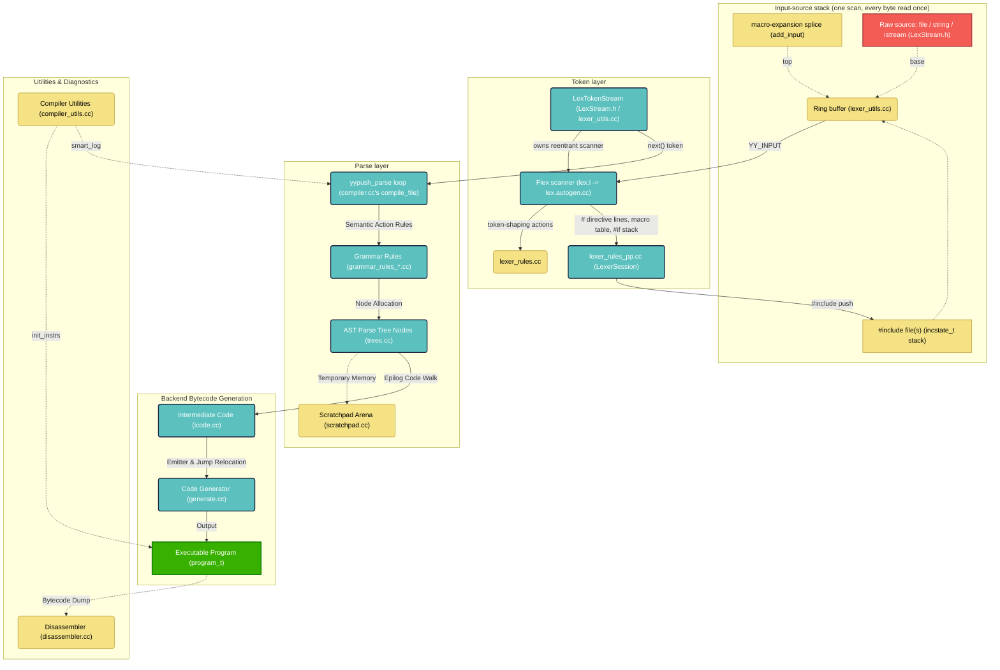

# FluffOS Compiler Subsystem (`src/compiler/internal/`)

This directory contains the core compiler, parser, lexer, preprocessor, and bytecode generation frontend of the FluffOS LPMUD VM.

Recent history: this frontend went through a substantial reentrancy/push migration (see `plans/repl-push-parser.md` and `plans/unified-push-lexer.md` for the full narrative and rationale) to lay groundwork for an interactive REPL (`lpcshell`, `src/main_lpcshell.cc`). The sections below describe the result, not the pre-migration design — in particular: `yyparse()` no longer exists (push-parser only), **there is no separate preprocessor** (preprocessing is part of the lexer's one scan; the old standalone `preprocessor.cc` engine was deleted), and the lexer is a reentrant Flex scanner threaded through explicit `yyscanner` handles rather than global state.

---

## Overall Subsystem Architecture

---

## Module Responsibilities

### 1. Byte/token stream layer (`LexStream.h`, `lexer_utils.cc`)
- **`LexStream`**: a plain `read(buffer, size)`/`close()` interface, nothing more. `FileLexStream`, `IStreamLexStream`, and `StringLexStream` wrap a real file descriptor, a `std::istream`, or an in-memory `std::string` respectively. This interface knows nothing about LPC or tokens — the lexer's input-source stack is built out of these.
- **`LexTokenStream`**: not a `LexStream` (it hands out tokens, not bytes). Owns a reentrant Flex scanner via RAII (`yylex_init_extra`/`yylex_destroy`) and exposes `load(stream, session)` + `next(&yylval)` + `scanner()`. This is the consolidation point `compile_file()` uses instead of wiring up scanner creation and the token-pull loop by hand. A single instance can be `load()`ed more than once, reusing the same scanner rather than tearing one down and building another — the mechanism a REPL needs to feed many small statements through one session cheaply. `session` is a `LexerSession` (see Module 2); passing the same session across `load()` calls keeps `#define` state alive between chunks.
- **`lexer_utils.cc`**: the ring buffer (`cur_lbuf`/`head_lbuf`/`outp`/`refill_buffer()`) that Flex's `YY_INPUT` macro pulls from, the `#include` input-source stack (`incstate_t`/`inctop`: `lpc_lex_handle_include()` pushes, `parseEofOrIncludePop()` pops at `<<EOF>>`), macro expansion's ring-buffer splicing (in `lpc_lex_resolve_identifier()`, via `add_input()`), predefine/include-path management, and `LexTokenStream`'s/`start_new_file()`'s implementations. Known scope boundary: this ring-buffer state is still file-scope static, not per-`LexTokenStream`-instance — two instances alive at once would corrupt each other's buffers. Not a problem today: `compile_file()`'s reentrancy guard already prevents concurrent compiles.

### 2. Preprocessing (`lexer_rules_pp.cc`, `lexer_rules_pp.h`) — part of the lexer's single scan
- **There is no separate preprocessor.** Preprocessing is a set of lexer rule actions inside the one and only scan (see `plans/unified-push-lexer.md` for the design and history): every byte of source is read exactly once, and each directive's effect applies at exactly its position in the token stream — which makes position-sensitive directives (`#pragma no_warnings` mid-file, `#line`) correct by construction, with a single `current_line` counter nothing else fights.
- **`lexer_rules_pp.cc` holds the preprocessing logic**: the macro table (`LpcMacroTable`, a plain map of `PpMacro`), `#define`/`#undef` parsing, the `#if`/`#elif` expression evaluator (`IfExprParser`), the conditional stack (`CondState`), textual macro expansion (`lpc_lex_expand_string()`, with guard lists for self-reference termination, `#` stringizing and `##` pasting via `substitute()` — `##` exists only inside macro bodies), `__LINE__`/`__FILE__`/`__DIR__` from the live scan position (`lpc_lex_builtin_macro()`), and the directive dispatcher (`lpc_lex_dispatch_directive()`) that lex.l's one anchored `#`-line rule calls.
- **`LexerSession`** (in `lexer_rules_pp.h`) is the persistence unit: macro table + conditional stack, held by `shared_ptr`. A normal file compile gets a fresh session per `start_new_file()`; a REPL can pass one session across chunks to keep `#define`s alive (each chunk must still be `#if`-balanced; an unterminated `#if` reports "Missing #endif" at EOF and the stack is cleared so the session stays usable).
- **How each directive is handled**: `#define`/`#undef` mutate the session's macro table; `#if`/`#ifdef`/`#ifndef`/`#elif`/`#else`/`#endif` drive the conditional stack — a false branch switches the scanner into the `SC_COND_SKIP` start condition, which consumes lines *without tokenizing them* (dead code may be deliberately invalid), tracking only nested conditional directives via `lpc_lex_classify_skip_directive()`; `#include` pushes the current input source onto the include stack and switches scanning to the opened file (pop at its EOF — stack-based, no recursion, no eager expansion); `#pragma`/`#line`/`#error`/`#warn`/`#echo` apply immediately in place.
- **Macro expansion happens at identifier-resolution time**, not as a text pre-pass: `lpc_lex_resolve_identifier()` (lexer_utils.cc) consults the macro table before the identifier hash; a hit expands the body (raw-capturing `(...)` arguments from the input for function-like macros) and splices the result into the ring buffer via `add_input()` for rescanning, with a `\x1e<name>` sentinel popping the active-expansion guard once the splice is consumed. Because string/char/template bodies are scanned by their own start conditions and never reach identifier resolution, "no expansion inside strings/templates/heredocs" falls out for free — no parallel quoting-rule implementations to keep in sync.

### 3. Lexer (`lex.l`, `lex.autogen.cc`, `lex.h`)
- **Responsibility**: THE scan — a reentrant Flex scanner (`%option reentrant`, threaded via an explicit `void *yyscanner` handle, no global lexer state) that turns raw LPC source (preprocessing included, per Module 2) into a token stream for the parser, one token's worth of work per `LexTokenStream::next()` pull.
- **`lex.l` is a thin rule table, not where the logic lives.** Mirroring how `grammar.y`'s actions mostly call a `rule_*()` function defined in `grammar_rules*.cc`, almost every substantive computation a lex.l rule needs lives in ordinary functions: token-shaping logic (number-literal parsing, string/template escape decoding including Unicode surrogate pairs, char-literal escape decoding, template-fragment closing, `$N` function-pointer parameters) in **`lexer_rules.cc`**, preprocessing logic in **`lexer_rules_pp.cc`** (Module 2). What's left inline in `lex.l` is, by necessity, only what can't move: Flex hides its scanner state (`yyguts_t`, `BEGIN()`/`YY_START`, `yyless()`) as macros/types private to the generated `lex.autogen.cc` translation unit, invisible to a separately-compiled `.cc` file — so start-condition transitions and buffer-rewind bookkeeping (`YY_PENDING_LOOKAHEAD()`/`outp -=`) stay in `lex.l`.
- **The directive rule's ordering is load-bearing** (documented at the rule): it rewinds `outp` past Flex's prefetch and consumes + counts the directive's terminating newline BEFORE dispatching, so an `#include` push records the exact parent resume point (with `outp[-1]` being the newline `refill_buffer()`'s include branch reuses as its sentinel), then flushes Flex's buffer after dispatch. The include push mirrors the legacy scanner's `handle_include()` byte-for-byte, including the `save_file_info`/`current_line_base` bookkeeping the (unmodified legacy) pop side assumes.
- **`compiler_context_t`** (declared in `lex.h`) holds all per-scanner-instance lexer state (template nesting/brace-depth tracking, the string/template accumulator, heredoc terminator, the old-style function-pointer `function_flag`, the `SC_COND_SKIP` nesting depth, the active-macro-expansion guard list) that used to be static globals — reached from `lex.l`/`lexer_rules*.cc` via `yyget_extra(yyscanner)`.
- **`lexer_utils.cc`** also still hosts a few hand-written, raw-`outp`-reading helpers that were never converted to native Flex rules: heredocs (`parseHeredoc()` — the closing terminator is supplied by the LPC source itself at compile time, so it can't be a static Flex pattern) and include-stack popping (`parseEofOrIncludePop()` — pure ring-buffer bookkeeping, not really "scanning").

### 4. Bison Parser (`grammar.y`, `grammar.autogen.cc`, `grammar.autogen.h`)
- **Responsibility**: LALR(1) parser definitions compiled via Bison, `%define api.pure full` (no global `yylval`/`yychar`) and **`%define api.push-pull push`**.
- **There is no `yyparse()`/`yypull_parse()` anymore.** Bison only generates `yypush_parse`/`yypstate_new`/`yypstate_delete`/`YYPUSH_MORE`. `compile_file()` in `compiler.cc` drives every compile through a hand-written `do { token = token_stream.next(&yylval); status = yypush_parse(pstate, token, &yylval, scanner); } while (status == YYPUSH_MORE);` loop (the `yypstate` owned by an RAII wrapper). For a normal whole-file compile this loop always runs to completion in one call — every token is available immediately — but it's the same token-at-a-time shape a future incremental/REPL driver needs, just without ever pausing between tokens today.

### 5. Grammar Rules & AST (`grammar_rules.cc`, `grammar_rules_*.cc`, `trees.cc`, `trees.h`)
- **Responsibility**: AST node representations and compiler semantic rule checks — type validation, block/switch/loop structuring.

### 6. Intermediate Code (`icode.cc`, `icode.h`)
- **Responsibility**: translates AST nodes into intermediate VM instruction representation.

### 7. Bytecode Emitter (`generate.cc`, `generate.h`)
- **Responsibility**: generates binary instructions in execution format, optimizes jumps, compiles `program_t` structures.

### 8. Core Compiler Driver (`compiler.cc`, `compiler.h`)
- **Responsibility**: the central orchestrator. `compile_file()` builds a `LexTokenStream`, calls `prolog()` (compiler-state init: `mem_block`, symbol tables, include paths, then `token_stream.load(stream)`), drives the `yypush_parse` loop described above, then `epilog()` to produce the final `program_t`.
- **`vm_context_t`**: `compile_file()` takes a `vm_context` parameter (defaulting to `&g_driver_vm_context`); the global `compiler_vm_context` it sets is null when no VM is booted (unit tests driving lexer/compiler pieces directly), and gates every VM interaction on the compile path — `smart_log()`'s master-apply error reporting, `yyerror()`'s mudlib-stats recording, `init_include_path()`'s `APPLY_GET_INCLUDE_PATH` query (which falls back to the config include list). Without this, those paths would push onto an eval stack that doesn't exist (`sp == nullptr`).
- **Reentrancy guard kept intentionally.** `compile_file()` saves/restores essentially all compiler-transient global state (`mem_block`, `comp_trees`, `string_idx`/`string_tags`, `type_of_locals`/`locals`, etc.) around each call, laying groundwork for eventual nested/recursive compilation — but the original `guard`-based check (`if (guard || current_file) error("Object cannot be loaded during compilation.\n");`) is still in place and still rejects a genuine nested `compile_file()` call. The save/restore machinery doesn't yet cover everything a nested compile would touch (`current_stream`, the `#include` stack, the old-style function-context stack in `lexer_utils.cc`, `inherit_file`) — see `plans/repl-push-parser.md` for the itemized list — so lifting the guard isn't safe yet.

---

## Key Utility Modules

- **`LexStream.h`**: the byte/token stream hierarchy — `LexStream` and its concrete subclasses, and `LexTokenStream`. See Module 1 above.
- **`lexer_utils.cc`, `lexer_utils.h`**: ring buffer, `#include` stack, macro-expansion splicing, predefine/include-path management, `LexTokenStream`/`start_new_file()` implementations.
- **`lexer_rules.cc`, `lexer_rules.h`**: token-shaping logic behind `lex.l`'s rule actions (see Module 3).
- **`lexer_rules_pp.cc`, `lexer_rules_pp.h`**: preprocessing logic behind `lex.l`'s directive rule (see Module 2).
- **`compiler_utils.cc`, `compiler_utils.h`**: compiler-wide diagnostics (`smart_log`) and system instruction setup (`init_instrs`).
- **`scratchpad.cc`, `scratchpad.h`**: high-performance scratch memory arena for temporary compile allocations.

---

## Interactive use: `lpcshell`

`src/main_lpcshell.cc` (not in this directory, but the reason several things above exist in their current shape) is a working interactive LPC REPL binary. It boots the driver like `lpcc` does, then evaluates one statement at a time using the **"restart pattern"**: each statement compiles as its own fresh in-memory object via `load_object_from_source()` (`vm/internal/simulate.cc`), reusing the entire `compile_file()` pipeline above unchanged rather than requiring a persistent compiler symbol table (that deeper design — real REPL-local variables sharing one continuously-open compile instead of textually-redeclared globals round-tripped through `save_variable()`/`restore_variable()` — remains open future work; see `plans/repl-push-parser.md`).

---

## Important Guidelines

1. **Header Inclusion Order constraint**:
   - `grammar.autogen.h` references Bison semantic types `decl_t` and `func_block_t` which are declared in `compiler/internal/grammar_rules.h`.
   - Therefore, any compiler file including `grammar.autogen.h` must include `compiler/internal/grammar_rules.h` **before** it.

2. **Global Header Inclusion Rule**:
   - Every source file (`.cc` / `.c`) in the driver (excluding `base/` and `packages/`) **must** include `"base/std.h"` as its very first line.
   - Follow it with a blank line to clearly separate it from other includes.

3. **What can move out of `lex.l` into `lexer_rules.cc`, and what can't**: only code that needs just the matched text (`yytext`/`yyleng`, passed explicitly), `yylval`, and/or the reentrant extra-data (`compiler_context_t`, reachable via the public `yyget_extra()`) can move. A rule that changes start condition (`BEGIN(...)`) or pushes back matched input (`yyless()`) must keep that part of its action inline in `lex.l` — those are macros tied to Flex's generated `yyguts_t` type, private to `lex.autogen.cc`.

4. **Autogenerated files**: `grammar.autogen.cc`/`.h` (from `grammar.y` via Bison) and `lex.autogen.cc` (from `lex.l` via Flex) are checked in but regenerated by the build; don't hand-edit them.
