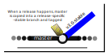
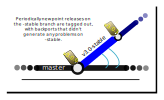
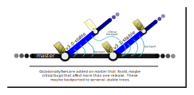

# lws release policy

## How should users consume lws?

The one definitively wrong way to consume lws (or anything else) is "import" some
version of it into your proprietary tree and think you will stick with that
forever, perhaps piling cryptic fixes or hacks on top until quite quickly,
nobody dare think about updating it.

The stable releases go on to a branch like v4.0-stable as described below, over
time these attract dozens or even hundreds of minor or major fix patches
backported from the development branch.  So you should not consume tags like
v4.0.0 but build into your planning that you will need to follow v4.0-stable in
order to stay on top of known bugs.

And we only backport fixes to the last stable release, although we will make
exceptions for important fixes.  So after a while, trying to stick with one
old versions means nobody is providing security fixes on it any more.  So you
should build into your planning that you will follow lws release upgrades.

If you find problems and create fixes, please upstream them, simplifying your
life so you can just directly consume the upstream tree with no private changes.

## Development

Master branch is the default and all new work happens there.  It's unstable and
subject to history rewrites, patches moving about and being squashed etc.  In
terms of it working, it is subject to passing CI tests including a battery of
runtime tests, so if it is passing CI as it usually is then it's probably in
usable shape.  See "Why no history on development" below for why it's managed like
that.


If you have patches (you are a hero) they should be targeted at `main`.

To follow such a branch, `git pull` is the wrong tool... the starting point
of what you currently have may no longer exist remotely due to rearranging the
patches there.  Instead use a flow like this:

```
 $ git fetch https://libwebsockets.org/repo/libwebsockets +main:m && git reset --hard m
```

This fetches current remote development branch into local branch `m`, and then forces your
local checkout to exactly match `m`.  This replaces your checked-out tree
including any of your local changes, so stash those first, or use stgit or so
to pop them before updating your basis against lws development.

## Stable branches

Master is very useful for coordinating development, and integrating WIP,
but for distros or integration into large user projects some stability is often
more desirable than the latest development work.

Periodically, when development seems in good shape and various new developments seem
to be working, it's copied out into a versioned stable branch, like `v4.0-stable`.



The initial copy is tagged with, eg, `v4.0.0`.

(At that time, development's logical version is set to "...99", eg, `v4.0.99` so
version comparisons show that development version is "later" than any other
v4.0 version, which will never reach 99 point releases itself, but "earlier"
than, eg, v4.1.)

## Backport policy

Development continues, and as part of that usually bugs are reported and / or
fixes found that may apply not just to current development, but the version of
the development branch that was copied to form the last -stable branch.

In that case, the patch may be backported to the last stable branch to also fix
the bug there.  In the case of refactors or major internal improvements, these
typically do not get backported.

This applies only to fixes and public API-neutral internal changes to lws... if
new features were backported or API changes allowed, then there would be
multiple apis under the same version name and library soname, which is
madness.

When new stable releases are made, the soname is bumped reflecting the API is
different than that of previous versions.


If there is something you need in a later lws version that is not backported,
you need to either backport it yourself or use a later lws version.
Using a more recent version of lws (and contributing fixes and changes so you
yourself can get them easily as well as contributing for others) is almost
always the correct way.

## Stable point releases

Periodically fix patches pile up on the -stable branch and are tagged out as
"point releases".  So if the original stable release was "v3.0.0", the point
release may be "v3.0.1".



## Critical fixes

Sometimes a bug is found and fixed that had been hiding for a few versions.
If the bug has some security dimension or is otherwise important, we may
backport it to a few recent releases, not just the last one.  This is pretty
uncommon though.



## Why no history on the development branch

Git is a wonderful tool that can be understood to have two main modes of operation,
merge and rebase that are mutually exclusive.  Most devs only use merge / pull,
but rebase / fetch is much more flexible.  Developing via rebases allows me to
dispense with feature branches during development and enables tracking multiple
in-progress patches in-tree by updating them in place.  If this doesn't make
sense or seems heretical to you, it's OK I don't need devsplain'ing about it,
just sit back and enjoy the clean, rapid development results.

Since stable branches don't allow new features, they are run as traditional trees
with a history, like a one-way pile of patches on top of the original release.  If
CI shows something is messed up with the latest patch, I will edit it in-place if
it has only been out for a few hours, but there is no re-ordering or other history
manipulation.

